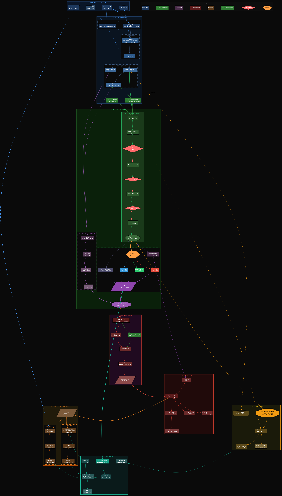

# Quantor-MTFuzz:# 🦅 CondorBrain: Institutional Iron Condor Trading System
> **"The H100-Optimized Mamba Intelligence"**

## 🚀 New in v2.0 (Scientific Update)
Full technical details available in [Scientific Specification](docs/scientific_spec.md).

- **🧠 Mamba Architecture:** Replaced Transformer with `Mamba SSM`, achieving $O(N)$ linear scaling and 3x training throughput.
- **⚡ H100 Optimization:** Custom `TF32`, `cuDNN Benchmark`, and `LazySequenceDataset` allow training on **10 Million Rows** (1.2B tokens) entirely in-memory.
- **🛡️ Robust Stability:** Implemented Z-Score Scaling ($x \leftarrow \frac{x-\mu}{\sigma}$) + Tanh Clipping to solve FP16 NaN divergence.
- **📊 Advanced Monitoring:** Real-time TensorBoard logging for per-head loss, regime expert activations, and 45-day price trajectories.
- **🔥 Production Sweep:** Automated hyperparameter tuning infrastructure capable of training 100M+ parameter models.

## 📋 Overview
CondorBrain is an advanced algorithmic trading system designed for SPY Iron Condor strategies, combining Multi-Timeframe (MTF) technical intelligence, Fuzzy Logic position sizing, and institutional-grade risk management.

**Quantor-MTFuzz** is a production-grade algorithmic trading system for SPY Iron Condor strategies, combining Multi-Timeframe (MTF) technical intelligence, Fuzzy Logic position sizing, and institutional-grade risk management.# 🦅 SPY Option Trader (Quantor-MTFuzz)

[](https://colab.research.google.com/github/trextrader/spy-iron-condor-trading/blob/main/colab/spyt_cloud_optimizer.ipynb)
 architectural specification with clean module separation, comprehensive testing, and mathematical rigor.

---

## 🚀 Key Features

### Core Capabilities
- **High-Fidelity Backtesting**: 5-minute bar simulation with accurate mark-to-market P&L, leg-by-leg exit logic, and realistic slippage/commissions
- **Phased Serial Optimization**: Grid-search engine optimizing for **Net Profit / Max Drawdown** ratio with hardware benchmarking
- **10-Factor Fuzzy Intelligence**: Dynamic position sizing based on MTF Consensus, IV Rank, VIX Regime, RSI, ADX, Bollinger Bands, Stochastic, Volume, SMA Distance, and **Parabolic SAR**
- **Mamba 2 Neural Forecasting**: Deep State-Space Model (12-32 layers) with **Diffusion Head** for trajectory refinement and **Topological Data Analysis (TDA)** for regime detection.

## 🧠 DeepMamba 2 Neural Engine

The system uses a custom **DeepMamba** architecture based on the Mamba 2 State-Space Model (SSM). Unlike Transformers, Mamba 2 offers linear scaling with sequence length, allowing the model to digest weeks of 15-minute bars (Lookback: 60-500) efficiently.

### Mathematical Foundation
The core mechanism is a discretized State Space Model:

$$ h'(t) = \mathbf{A}h(t) + \mathbf{B}x(t) $$
$$ y(t) = \mathbf{C}h(t) $$

Where:
*   $h(t)$ is the hidden state (memory)
*   $x(t)$ is the input vector (Log Returns, RSI, ATR, Vol Ratio)
*   $\mathbf{A}$ is the evolution matrix (diagonalized in Mamba 2 via SSD)

In the **DeepMamba** implementation:
*   **Input**: $(B, L, 4)$ tensor [LogRet, NormRSI, NormATR, NormVol]
*   **Backbone**: $N$ layers of Mamba 2 Blocks (Residual + RMSNorm)
*   **Output**: Next-bar Log Return prediction (Regression)

### Training Workflow
The model creates its own "Brain" using historical intraday data.

**1. Data Acquisition (Local)**
```powershell
# Fetch 2 years of 15-min bars from Alpaca
python intelligence/train_mamba.py --save-only
```

**2. GPU Training (Colab)**
```python
# Train the 12-layer model (Fast & Accurate)
!python intelligence/train_mamba.py --local-data data/spy_training_data.csv --d-model 256 --layers 12
```

**3. Inference (Backtest)**
The optimizer automatically loads `models/mamba_active.pth` and uses the GPU for batch inference (processing 500+ bars in parallel).

```python
!python core/main.py --use-optimizer --mamba-d-model 256 --mamba-layers 12
```
### 📊 Real-Time Monitoring Dashboard

The system provides a high-fidelity visual experience for tracking model convergence across all 23 output heads.

````carousel

<!-- slide -->

<!-- slide -->

````

**Key Features:**
- **Real-time TensorBoard Integration:** Scalar metrics, per-head distributions, and images.
- **Intra-Epoch Live Plots:** Inline scatter plots every $N$ batches (throlled for performance).
- **Visual Export & Snapshots:** Automatic PNG snapshots to `training_analytics/epoch_snapshots/`.

## 🦅 Stage 2 & 3: Intelligence & Risk Safeguards

The system has been upgraded with institutional-grade decision logic and safety guardrails:

### Stage 2: Strategy Depth (Intelligence)
- **Regime-Adaptive Wings**: Dynamically scales Iron Condor wing widths based on market states (e.g., wider wings in `CRASH_MODE`, tighter in `LOW_VOL_RANGE`).
- **Skew-Aware Strike Selection**: Automatically detects and penalizes unfavorable IV skew. Avoids "Put Traps" where heavy downside skew would normally force too-close strikes.
- **Probabilistic Entry Filter**: Rejects trades where the Delta-based probability of breach exceeds safety thresholds for any leg.
- **Market Regime Classifier**: Real-time classification into Bull/Bear Trends, Volatile Ranges, or Ranging states using ADX, VIX, and SMA alignment.

### Stage 3: Institutional Risk Management
- **RiskManager Class**: A centralized gatekeeper (`core/risk_manager.py`) that validates every trade against portfolio and account limits.
- **Portfolio Greeks Aggregator**: Real-time tracking of net Delta, Gamma, Vega, and Theta across the entire option portfolio.
- **Dynamic Risk Caps**: Enforces maximum net Greeks per trade and portfolio-wide (e.g., hard stop if Portfolio Delta > 200).
- **Daily Drawdown Stop**: Automatic "kill-switch" that halts trading for the day if realized/unrealized losses breach a configurable percentage (e.g., 2% of equity).
- **Stress Test Runner**: A dedicated tool (`scripts/backtest/run_stress_test.py`) to evaluate strategy robustness under parameter shocks and historical volatility spikes.

### 💻 CLI Command Reference

Execute `core/main.py` with the following flags to control strategy behavior:

| Scenario | Command | Description |
|---|---|---|
| **Production Backtest** | `python core/main.py --mode backtest --use-mtf --use-fuzzy --dynamic-sizing --bt-samples 0` | **Recommended**: Full 10-factor fuzzy logic + MTF consensus on all data. |
| **Optimization** | `python core/main.py --mode backtest --use-optimizer --use-mtf --use-fuzzy --dynamic-sizing` | Runs the 5-phase optimization matrix (see below). |
| **Baseline (Simple)** | `python core/main.py --mode backtest --no-mtf-filter --no-fuzzy` | Pure mechanical Iron Condor (no intelligence). |
| **Why MTF Only?** | `python core/main.py --mode backtest --use-mtf --no-fuzzy` | Tests impact of multi-timeframe consensus in isolation. |
| **Why Fuzzy Only?** | `python core/main.py --mode backtest --use-fuzzy --dynamic-sizing --no-mtf-filter` | Tests impact of 10-factor position sizing in isolation. |
| **Custom Dates** | `python core/main.py --mode backtest --bt-start 2024-01-01 --bt-end 2024-03-31` | Backtest specific historical period. |
| **Risk Stress Test** | `python scripts/backtest/run_stress_test.py` | Runs sensitivity analysis & stress test suite. |
| **Paper Trading** | `python core/main.py --mode live --alpaca` | Connects to Alpaca Paper API for live execution. |

> **Note**: `--bt-samples 0` loads the ENTIRE dataset. Remove it to default to 500 samples for quick debugging.

### 🛠 Data Factory Tools
The `data_factory/` directory contains tools to generate high-fidelity datasets:

1. **Option Expansion (`expand_options_intraday.py`)**:
   Synthesizes 1-minute and 5-minute option chains from daily snapshots using Black-Scholes interpolation + real intraday spot data.
   ```bash
   python data_factory/expand_options_intraday.py --input data/ivolatility/your_file.csv
   ```

### 🔬 6-Phase Serial Optimization (NEW)
The system employs a segmented optimization engine to tune 30+ parameters without overfitting:

1.  **Phase 1: Exits & Risk** (Timing)
    *   Targets: Profit targets, stop-losses, max hold days, risk limits
    *   Goal: Optimize trade pacing and risk/reward ratios.
2.  **Phase 2: Structure & Entries** (Mechanics)
    *   Targets: Delta selection (0.10-0.30), wing widths, credit minimums
    *   Goal: Tune the instrument structure for the current market.
3.  **Phase 3: Filters & Regime** (Safety)
    *   Targets: IV Rank gates, VIX thresholds, volatility caps
    *   Goal: Refine entry gates to avoid high-risk environments.
4.  **Phase 4: Momentum Logic** (Signals)
    *   Targets: RSI/Stoch neutral zones, ADX trend thresholds
    *   Goal: Optimize momentum-based entry logic.
5.  **Phase 5: Trend & Volatility** (Context)
    *   Targets: Bollinger Band squeeze, SMA distance, PSAR acceleration
    *   Goal: Fine-tune trend-following and mean-reversion triggers.
6.  **Phase 6: Fuzzy Weights** (The Blend)
    *   Targets: Relative weights of MTF, IV, Regime, RSI, ADX, and Neural Forecasts.
    *   Goal: Optimize the neuro-fuzzy decision blend for final sizing.

### 🔍 Optimizable Parameter Reference (6-Phase Matrix)

Below is the complete list of parameters tunable via the `core/optimizer.py` engine, matched with defaults from `core/config.py`.

#### 1. Phase 1: Exits & Risk (The Pacing)
| Parameter | Default | Optimization Range |
|:---|:---:|:---|
| `profit_take_pct` | 0.40 | 0.40 - 0.95 (Step 0.1) |
| `loss_close_multiple` | 1.00 | 1.0 - 3.0 (Step 0.5) |
| `max_hold_days` | 10 | 10, 14, 21, 30 |
| `max_account_risk_per_trade` | 0.02 | 1%, 2%, 3% |

#### 2. Phase 2: Structure & Entries (The Vehicle)
| Parameter | Default | Optimization Range |
|:---|:---:|:---|
| `target_short_delta_low` | 0.08 | 0.10, 0.12, 0.15 |
| `target_short_delta_high` | 0.25 | 0.20, 0.25, 0.30 |
| `wing_width_min` | 5.0 | 5.0, 10.0 |
| `min_credit_to_width` | 0.10 | 10%, 15%, 20% |
| `use_skew_penalty` | True | True, False |

#### 3. Phase 3: Filters & Regime (The Safety)
| Parameter | Default | Optimization Range |
|:---|:---:|:---|
| `iv_rank_min` | 0.0 | 0.0, 10.0, 20.0, 30.0 |
| `vix_threshold` | 25.0 | 25.0, 30.0, 40.0 |
| `vix_threshold_low` | 20.0 | 15.0, 18.0, 20.0 |
| `max_volatility_pct` | 0.02 | 2%, 3%, 4% |

#### 4. Phase 4: Momentum Logic (RSI, Stoch, ADX)
| Parameter | Default | Optimization Range |
|:---|:---:|:---|
| `rsi_neutral_min` | 30 | 30, 40 |
| `rsi_neutral_max` | 60 | 60, 70 |
| `stoch_neutral_min` | 30 | 20, 30 |
| `stoch_neutral_max` | 70 | 70, 80 |
| `adx_threshold_low` | 25.0 | 20.0, 25.0, 30.0 |
| `use_adx_filter` | True | True, False |

#### 5. Phase 5: Trend & Volatility (BBands, SMA, PSAR)
| Parameter | Default | Optimization Range |
|:---|:---:|:---|
| `bbands_squeeze_threshold` | 0.02 | 1%, 2%, 3% |
| `sma_max_distance` | 0.02 | 1%, 2%, 3%, 4% |
| `psar_acceleration` | 0.02 | 0.02, 0.025 |
| `psar_max_acceleration` | 0.20 | 0.20, 0.25 |
| `use_psar_filter` | True | True, False |

#### 6. Phase 6: Fuzzy Weights (The Blend) - NEW
Optimizes the 11-factor fuzzy weight blend including Neural Network influence.

| Parameter | Default | Optimization Range |
|:---|:---:|:---|
| `fuzzy_weight_neural` | 0.20 | 0.10, 0.20, 0.30 |
| `fuzzy_weight_mtf` | 0.18 | 0.10, 0.18, 0.25 |
| `fuzzy_weight_iv` | 0.14 | 0.10, 0.14, 0.20 |
| `fuzzy_weight_regime` | 0.11 | 0.08, 0.11, 0.15 |
| `fuzzy_weight_rsi` | 0.10 | 0.05, 0.10, 0.15 |
| `fuzzy_weight_adx` | 0.10 | 0.05, 0.10, 0.15 |

*Additional weights (BBands, Stoch, Volume, SMA, PSAR) are available but commented out to reduce search space.*


### Phase 1+ Analytics & Data Pipeline (NEW)
- **Volatility Risk Premium (VRP)**: Realized vs Implied volatility edge detection
- **SPY-ES Divergence**: Z-score based divergence trading signals
- **IV Skew Analysis**: Crash-risk detection via put/call skew metrics
- **Gap Classification**: Overnight gap-fill mean-reversion logic
- **Cost-of-Carry**: Futures fair value and basis calculations
- **Real Indicators**: ADX/RSI/IV Rank with Wilder smoothing for 5-minute bars
- **Lag-Aware Data Pipeline**: Institutional-grade timestamp alignment with IV confidence decay
  - Auto-overlap day selection (spot ∩ options)
  - ChainAlignment engine (exact/prior/stale/none modes)
  - IV confidence decay: `iv_conf = 0.5^(lag_sec / 300)`
  - Per-symbol lag limits (SPY/QQQ: 600s, SPX: 900s)
  - Fail-fast mode (abort if stale rate > 20%)
  - Comprehensive diagnostics (exact match%, lag distribution, IV conf stats)

---

## 🏗️ Architecture: Quantor-MTFuzz Specification

The system architecture is tiered into four layers of intelligence, combining high-fidelity Mamba SSM forecasting with a robust Neural-Fuzzy decision suite.

- **[Weekly Technical Progress Report (Jan 13)](docs/internal/WEEKLY_SUMMARY_2026-01-13.md):** Summary of recent high-impact work.
- **[Technical Architecture Summary](docs/architecture/technical_architecture_summary.md):** A one-page engineering overview.
- **[Institutional Execution Flow](docs/architecture/institutional_execution_flow.png):** The complete lifecycle from data to trade analysis.

### Intelligence Flow Overview


### Module Hierarchy
```
core/
├── dto.py            → DTOs (MarketSnapshot, TradeDecision, etc.)
├── engine.py         → TradingEngine orchestrator
├── backtest_engine.py → Backtrader integration (legacy)
├── config.py         → Configuration model
└── risk_manager.py   → Portfolio risk gate

data_factory/         [NEW - Phase 2]
├── spot_bars.py      → Multi-timeframe OHLCV provider (1/5/15m)
├── option_chain.py   → Lag-aware chain alignment with IV decay
├── aux_feeds.py      → Gap analysis helpers
├── data_engine.py    → MarketSnapshot streaming + auto-overlap
├── sync_engine.py    → MTF data synchronization (legacy)
└── polygon_client.py → Market data provider (legacy)

strategies/
└── options_strategy.py → Iron Condor signal gating & strike selection

intelligence/
├── fuzzifier.py      → Feature extraction (ADX/RSI/IV Rank)
├── fuzzy_engine.py   → Fuzzy position sizing
├── regime_filter.py  → Market regime classification
└── mamba_engine.py   → Neural forecasting (Mamba 2)

analytics/            [Phase 1]
├── realized_vol.py   → Realized volatility calculator
├── divergence.py     → SPY-ES Z-score
├── skew.py           → IV skew metrics
├── gaps.py           → Gap analyzer
├── carry_model.py    → Cost-of-carry model
└── indicators.py     → ADX/RSI/IV Rank

risk/
└── risk_manager.py   → Greeks tracking, drawdown caps

tests/                [Phase 1]
└── test_*.py         → 18 unit tests (pytest)
```

---

## 🧮 Mathematical Foundation

### 1. Volatility Risk Premium (VRP) - `analytics/realized_vol.py`

**Theory**: The VRP is the edge captured by selling options when implied volatility exceeds realized volatility.

#### Realized Volatility Calculation
$$ RV^2 = \frac{252}{N} \sum_{t=1}^{N} r_t^2 $$

Where:
- $r_t = \ln\left(\frac{P_t}{P_{t-1}}\right)$ = log return at time $t$
- $N$ = rolling window length (e.g., 78 bars for 1 trading day of 5-min data)
- $252$ = annualization factor (trading days per year)

$$ RV = \sqrt{RV^2} $$

#### VRP Signal
$$ VRP = IV_{ATM} - RV $$

**Entry Gate**: Trade only if $VRP > \theta_{VRP}$ (e.g., $\theta_{VRP} = 0.02$ or 2%)

**Implementation**:
```python
from analytics.realized_vol import RealizedVolCalculator

calc = RealizedVolCalculator()
rv = calc.compute_realized_vol(close_prices, window=78)
vrp = implied_vol - rv

if vrp > 0.02:
    # Favorable environment for selling premium
    pass
```

---

### 2. SPY-QQQ Divergence Trading - `analytics/divergence.py`

**Theory**: SPY (Broad Market) and QQQ (Tech) usually correlate. Divergences in their ratio signal temporary over-extension of one sector versus the other.

#### Spread Calculation (Ratio)
$$
S_t = \frac{P_{\mathrm{SPY},t}}{P_{\mathrm{QQQ},t}}
$$

Where:
- $P_{\mathrm{SPY},t}$ = SPY spot price
- $P_{\mathrm{QQQ},t}$ = QQQ spot price

#### Z-Score Normalization
$$
z_t = \frac{S_t - \mu_S}{\sigma_S}
$$

Where:
- $\mu_S = \frac{1}{N}\sum_{i=t-N+1}^{t} S_i$ = rolling mean of ratio
- $\sigma_S = \sqrt{\frac{1}{N-1}\sum_{i=t-N+1}^{t} (S_i - \mu_S)^2}$ = rolling std dev

**Trading Signals**:
- $z > +2$: SPY overvalued vs QQQ → **Bearish SPY bias** (widen put wing for SPY)
- $z < -2$: SPY undervalued vs QQQ → **Bullish SPY bias** (widen call wing for SPY)
- $|z| \leq 2$: Neutral relative strength

**Implementation**:
```python
from analytics.divergence import DivergenceZScore

div = DivergenceZScore()
spread = div.compute_spread(spy_price=580.0, qqq_price=480.0)
z = div.zscore(ratio_series, lookback=50)

if z > 2.0:
    bias = "bearish"
elif z < -2.0:
    bias = "bullish"
```

---

### 3. IV Skew Analysis - `analytics/skew.py`

**Theory**: Put skew (higher IV for OTM puts) indicates crash risk. Steep skew suggests expensive downside protection.

#### Skew Metric
$$
\text{Skew} = \frac{IV_{\mathrm{put}} - IV_{\mathrm{call}}}{IV_{\mathrm{ATM}}}
$$

Where:
- $IV_{put}$ = Implied volatility of OTM put (e.g., 15-delta)
- $IV_{call}$ = Implied volatility of OTM call (e.g., 15-delta)
- $IV_{ATM}$ = Implied volatility of ATM option

**Interpretation**:
- $\text{Skew} > 0.15$: **Steep put skew** → Crash risk elevated → Widen put wing or reduce size
- $\text{Skew} \approx 0$: Flat skew → Normal market
- $\text{Skew} < 0$: Call skew (rare) → Potential rally risk

**Risk Adjustment**:
$$
W_{\mathrm{put}} = W_{\mathrm{base}} + \Delta W \cdot \mathbb{1}_{\{\text{Skew} > \theta_{\mathrm{skew}}\}}
$$

Where:
- $W_{put}$ = Put wing width
- $W_{base}$ = Base wing width (e.g., 5 strikes)
- $\Delta W$ = Increment (e.g., 5 strikes)
- $\theta_{skew}$ = Skew threshold (e.g., 0.15)

**Implementation**:
```python
from analytics.skew import SkewCalculator

skew_calc = SkewCalculator()
skew = skew_calc.skew_metric(iv_put=0.30, iv_call=0.20, iv_atm=0.25)

if skew_calc.is_steep_skew(skew, threshold=0.15):
    # Widen put wing or reduce position size
    put_wing_width += 5
```

---

### 4. Gap Analysis - `analytics/gaps.py`

**Theory**: Small overnight gaps (< 0.19%) tend to fill intraday due to mean-reversion. Large gaps indicate momentum continuation.

#### Gap Percentage
$$
G = \frac{|P_{open} - P_{prev\_close}|}{P_{prev\_close}}
$$

**Classification**:
- $G \leq 0.0019$ (0.19%): **Small gap** → High probability of fill → Enable legged entry
- $G > 0.0019$: **Large gap** → Momentum continuation → Standard entry or skip

**Gap Direction**:

$$
\text{Direction} = \begin{cases} 
\text{Gap Up} & \text{if } P_{open} > P_{prev\_close} \cdot 1.0001 \\ 
\text{Gap Down} & \text{if } P_{open} < P_{prev\_close} \cdot 0.9999 \\ 
\text{No Gap} & \text{otherwise} 
\end{cases}
$$

**Implementation**:
```python
from analytics.gaps import GapAnalyzer

gaps = GapAnalyzer()
gap_pct = gaps.gap_pct(open_price=580.5, prev_close=580.0)
is_small = gaps.is_small_gap(open_price=580.5, prev_close=580.0)

if is_small:
    # Enable legged entry (enter call/put spreads separately)
    allow_legged_entry = True
```

---

### 5. Cost-of-Carry Model - `analytics/carry_model.py`

**Theory**: Futures fair value is determined by the cost of carrying the underlying asset (interest minus dividends).

#### Fair Value Formula
$$
F = S \cdot e^{(r - q) \tau}
$$

Where:
- $F$ = Futures fair value
- $S$ = Spot price (SPY)
- $r$ = Risk-free rate (annualized, e.g., 0.05 = 5%)
- $q$ = Dividend yield (annualized, e.g., 0.015 = 1.5%)
- $\tau$ = Time to expiration (years)

#### Basis
$$
\text{Basis} = F_{market} - S
$$

**Interpretation**:
- $\text{Basis} > 0$: **Contango** (normal market)
- $\text{Basis} < 0$: **Backwardation** (stress/demand for spot)

**Implementation**:
```python
from analytics.carry_model import CostOfCarry

carry = CostOfCarry()
fair_value = carry.fair_value(spot=580.0, r=0.05, q=0.015, tau_years=0.25)
basis = carry.basis(futures_price=582.0, spot=580.0)

if basis < 0:
    # Backwardation - potential stress signal
    reduce_size = True
```

---

### 6. Technical Indicators (11-Factor Fuzzy System) - `intelligence/fuzzy_engine.py`

The fuzzy position sizing system uses 11 indicators (10 technical + 1 neural), blending them into a final confidence score $C \in [0, 1]$:

$$ F_t = \sum_{j=1}^{10} w_j \cdot \mu_j $$
$$ C = 0.10 \cdot \mu_{\mathrm{Mamba}} + 0.90 \cdot F_t $$

| # | Factor | Weight | Description |
|---|--------|--------|-------------|
| 1 | **DeepMamba 2** | 0.10 (Rel) | Neural forecast confidence |
| 2 | MTF Consensus | 0.10 | Multi-timeframe alignment |
| 3 | IV Rank | 0.10 | Implied volatility percentile |
| 4 | VIX Regime | 0.08 | Market fear index |
| 5 | RSI | 0.05 | Momentum oscillator |
| 6 | ADX | 0.05 | Trend strength |
| 7 | Bollinger Bands | 0.15 | Range positioning |
| 8 | Stochastic | 0.15 | Momentum neutrality |
| 9 | Volume | 0.12 | Liquidity confirmation |
| 10 | SMA Distance | 0.10 | Mean reversion potential |
| 11 | Parabolic SAR | 0.10 | Trend reversal detection |

---

#### 6.1 MTF Consensus (w = 0.10)

**Theory**: Multi-timeframe alignment measures agreement across 1m, 5m, and 15m timeframes. Neutral consensus favors Iron Condors.

$$
\mu_{MTF} = 1 - |C_{\mathrm{1/5/15}} - 0.5| \times 2
$$

Where $C_{1/5/15} \in [0, 1]$ is the weighted consensus:
- $C = 0.5$: Perfect neutral → $\mu = 1.0$ (ideal for IC)
- $C = 0$ or $1$: Strong trend → $\mu = 0.0$ (avoid)

---

#### 6.2 IV Rank (w = 0.10)

**Theory**: High IV Rank means elevated implied volatility relative to history—favorable for selling premium.

$$
IVR = 100 \cdot \frac{IV_t - \min(IV_{\mathrm{window}})}{\max(IV_{\mathrm{window}}) - \min(IV_{\mathrm{window}})}
$$

**Membership**:

$$
\mu_{IV} = \min\left(1.0, \frac{IVR}{60}\right)
$$

- $IVR \geq 60$: $\mu = 1.0$ (excellent for premium selling)
- $IVR = 30$: $\mu = 0.5$ (moderate)
- $IVR = 0$: $\mu = 0.0$ (avoid selling premium)

---

#### 6.3 VIX Regime (w = 0.08)

**Theory**: Low VIX indicates stable markets; high VIX signals fear and potential oversized moves.

**Membership**:

$$
\mu_{VIX} = \begin{cases} 
1.0 & \text{if } VIX \leq 12 \\ 
1 - \frac{VIX - 12}{18} & \text{if } 12 < VIX < 30 \\ 
0.0 & \text{if } VIX \geq 30 
\end{cases}
$$

- $VIX \leq 12$: $\mu = 1.0$ (calm market, ideal)
- $VIX = 20$: $\mu \approx 0.56$ (moderate caution)
- $VIX \geq 30$: $\mu = 0.0$ (high risk, skip)

---

#### 6.4 RSI (w = 0.05) - Wilder Smoothing

$$ RS = \frac{EMA_{\alpha}(\text{Gain})}{EMA_{\alpha}(\text{Loss})} $$

$$ RSI = 100 - \frac{100}{1 + RS} $$

Where $\alpha = \frac{1}{period}$ (default $period = 14$)

**Membership** (neutral zone 40-60 is optimal):

$$
\mu_{RSI} = \begin{cases} 
1.0 & \text{if } 40 \leq RSI \leq 60 \\ 
\frac{RSI}{40} & \text{if } RSI < 40 \\ 
\frac{100 - RSI}{40} & \text{if } RSI > 60 
\end{cases}
$$

- $RSI \in [40, 60]$: $\mu = 1.0$ (neutral momentum, ideal)
- $RSI < 30$ or $RSI > 70$: $\mu \to 0$ (extreme, avoid)

---

#### 6.5 ADX (w = 0.05) - Wilder Smoothing

$$ +DI = 100 \cdot \frac{EMA_{\alpha}(+DM)}{ATR} $$

$$ -DI = 100 \cdot \frac{EMA_{\alpha}(-DM)}{ATR} $$

$$ DX = 100 \cdot \frac{|+DI - (-DI)|}{+DI + (-DI)} $$

$$ ADX = EMA_{\alpha}(DX) $$

**Membership** (low ADX = weak trend = favorable):

$$
\mu_{ADX} = \begin{cases} 
1.0 & \text{if } ADX \leq 25 \\ 
1 - \frac{ADX - 25}{15} & \text{if } 25 < ADX < 40 \\ 
0.0 & \text{if } ADX \geq 40 
\end{cases}
$$

- $ADX < 25$: $\mu = 1.0$ (ranging market, ideal)
- $ADX > 40$: $\mu = 0.0$ (strong trend, avoid)

---

#### 6.6 Bollinger Bands (w = 0.15)

$$
\mathrm{Upper} = SMA_{20} + 2 \cdot \sigma_{20}
$$

$$
\mathrm{Lower} = SMA_{20} - 2 \cdot \sigma_{20}
$$

$$
BB_{\mathrm{position}} = \frac{Price - \mathrm{Lower}}{\mathrm{Upper} - \mathrm{Lower}}
$$

$$
BB_{\mathrm{width}} = \frac{\mathrm{Upper} - \mathrm{Lower}}{SMA_{20}}
$$

**Membership** (middle of bands = ideal):

$$
\mu_{\mathrm{BB}} = 0.7 \times (1 - |BB_{\mathrm{position}} - 0.5| \times 2) + 0.3 \times \max\left(0, 1 - \frac{BB_{\mathrm{width}}}{0.04}\right)
$$

- $BB_{\mathrm{position}} = 0.5$: $\mu \to 1.0$ (price at center)
- $BB_{\mathrm{position}} < 0.05$ or $> 0.95$: $\mu \to 0$ (touching bands, avoid)

---

#### 6.7 Stochastic Oscillator (w = 0.15)

$$
\%K = 100 \cdot \frac{\mathrm{Close} - \mathrm{Low}_{14}}{\mathrm{High}_{14} - \mathrm{Low}_{14}}
$$

$$
\%D = SMA_3(\%K)
$$

**Membership** (neutral zone 30-70 is optimal):

$$
\mu_{\mathrm{Stoch}} = \begin{cases} 
1.0 & \text{if } 30 \leq \%K \leq 70 \\ 
\frac{\%K}{30} & \text{if } \%K < 30 \\ 
\frac{100 - \%K}{30} & \text{if } \%K > 70 
\end{cases}
$$

- $\%K \in [30, 70]$: $\mu = 1.0$ (neutral, ideal)
- $\%K < 20$ or $> 80$: $\mu \to 0$ (extreme, avoid)

---

#### 6.8 Parabolic SAR (w = 0.10)

$$
SAR_{t+1} = SAR_t + AF \cdot (EP - SAR_t)
$$

Where:
- $AF$ = Acceleration Factor (0.02 → 0.20)
- $EP$ = Extreme Point (highest high / lowest low)

**Membership** (crossover = ideal):

$$
\mu_{\mathrm{PSAR}} = 1 - |P_{\mathrm{position}}|
$$

Where $P_{position} \in [-1, +1]$:
- $P_{\mathrm{position}} = 0$: PSAR crossover → $\mu = 1.0$ (ideal for IC)
- $|P_{\mathrm{position}}| = 1$: Strong trend → $\mu = 0.0$ (avoid)

---

#### 6.9 Volume (w = 0.12)

$$
V_{\mathrm{ratio}} = \frac{Volume_t}{SMA_{20}(Volume)}
$$

**Membership** (adequate liquidity required):

$$
\mu_{\mathrm{Vol}} = \min\left(1.0, \frac{V_{\mathrm{ratio}}}{0.8}\right)
$$

- $V_{\mathrm{ratio}} \geq 0.8$: $\mu = 1.0$ (adequate liquidity)
- $V_{\mathrm{ratio}} < 0.4$: $\mu < 0.5$ (poor fills likely)

---

#### 6.10 SMA Distance (w = 0.10)

$$ D_{SMA} = \frac{Price - SMA_{20}}{SMA_{20}} $$

**Membership** (near equilibrium = ideal):

$$
\mu_{\mathrm{SMA}} = \begin{cases} 
1 - \frac{|D_{\mathrm{SMA}}|}{0.02} & \text{if } |D_{\mathrm{SMA}}| \leq 0.02 \\ 
0.0 & \text{if } |D_{\mathrm{SMA}}| > 0.02 
\end{cases}
$$

- $|D_{\mathrm{SMA}}| = 0$: $\mu = 1.0$ (at equilibrium)
- $|D_{\mathrm{SMA}}| > 2\%$: $\mu = 0.0$ (extended, mean reversion risk)

---

**Implementation**:
```python
from intelligence.fuzzy_engine import (
    calculate_mtf_membership,
    calculate_iv_membership,
    calculate_regime_membership,
    calculate_rsi_membership,
    calculate_adx_membership,
    calculate_bbands_membership,
    calculate_stoch_membership,
    calculate_psar_membership,
    calculate_volume_membership,
    calculate_sma_distance_membership,
    compute_fuzzy_confidence
)

# All memberships in [0, 1]
memberships = {
    "mtf": 0.60, "iv": 0.80, "regime": 0.70,
    "rsi": 0.50, "adx": 0.85, "bbands": 0.65,
    "stoch": 0.55, "psar": 0.90, "volume": 0.75, "sma": 0.80
}

weights = {
    "mtf": 0.18, "iv": 0.14, "regime": 0.11, "rsi": 0.10,
    "adx": 0.10, "bbands": 0.09, "stoch": 0.08, "psar": 0.07,
    "volume": 0.07, "sma": 0.06
}

Ft = compute_fuzzy_confidence(memberships, weights)
print(f"Fuzzy Confidence: {Ft:.2f}")  # → 0.71
```

---

## 🧠 7. DeepMamba 2 Neural Forecasting Engine

The system leverages a **State-Space Model (SSM)** architecture (Mamba 2) for high-fidelity market forecasting. Unlike Transformers, Mamba scales linearly with sequence length and maintains a persistent "memory" of market state.

### 7.1 Architecture Details
*   **Model**: `DeepMamba` (Custom PyTorch implementation)
*   **Layers**: 16–32 selective SSM layers
*   **Dimension** ($d_{model}$): 64–1024
*   **State Dim** ($d_{state}$): 32
*   **Activation**: Selective Hidden State Evolution with $Tanh$ head

### 7.2 Mathematical Foundation

The core of the Mamba block is a continuous-time system discretized for digital computation:

#### Continuous Form
$$ h'(t) = \mathbf{A}h(t) + \mathbf{B}x(t) $$
$$ y(t) = \mathbf{C}h(t) $$

#### Discretization (Zero-Order Hold)
To process discrete market bars, the parameters are transformed using step size $\Delta$:
$$ \overline{\mathbf{A}} = \exp(\Delta \mathbf{A}) $$
$$ \overline{\mathbf{B}} = (\Delta \mathbf{A})^{-1}(\exp(\Delta \mathbf{A}) - \mathbf{I}) \cdot \Delta \mathbf{B} $$

#### Selective Mechanism
Mamba 2 makes $\Delta, \mathbf{B}, \mathbf{C}$ functions of the input $x_t$, allowing the model to selectively propagate or reset its hidden state based on market volatility:
$$ \Delta_t = \text{Softplus}(\text{Linear}(x_t)) $$
$$ \mathbf{B}_t = \text{Linear}(x_t), \quad \mathbf{C}_t = \text{Linear}(x_t) $$

### 7.3 Feature Engineering (Input Vector)
The model consumes advanced features including TDA signatures and Manifold Volatility:
$$ \vec{V}_t = [ \Delta \log(P_t), \text{RSI}_{norm}, \text{Curvature}, \text{Persistence}_1 ] $$

### 7.4 Generative Diffusion Head
A conditional diffusion module (DDPM) refines the Mamba hidden state into a probabilistic price trajectory (32 steps), capturing uncertainty in high-volatility regimes.

---

## 📊 Iron Condor Strategy Mathematics

### Structure
An Iron Condor consists of 4 legs:

1. **Short Call** ($C_s$): Sell OTM call (e.g., 15-delta)
2. **Long Call** ($C_l$): Buy further OTM call (protection)
3. **Short Put** ($P_s$): Sell OTM put (e.g., 15-delta)
4. **Long Put** ($P_l$): Buy further OTM put (protection)

### Credit Received
$$
Credit = (C_s - C_l) + (P_s - P_l)
$$

### Maximum Loss
$$
MaxLoss = W - Credit
$$

Where $W$ = wing width (e.g., $W = K_{C_l} - K_{C_s} = K_{P_s} - K_{P_l}$)

### Mark-to-Market P&L
$$
PnL_{\mathrm{t}} = (Credit - Cost_{\mathrm{t}}) \times Q \times 100
$$

Where:
- $Cost_t = (C_{s,t} - C_{l,t}) + (P_{s,t} - P_{l,t})$ = current replacement cost
- $Q$ = number of contracts
- $100$ = option multiplier

### Exit Conditions

#### Profit Take
$$
PnL_{\mathrm{t}} \geq Credit \cdot \alpha_{\mathrm{PT}}
$$

Example: $\alpha_{PT} = 0.50$ (50% of max profit)

#### Stop Loss
$$
PnL_{\mathrm{t}} \leq -Credit \cdot \alpha_{\mathrm{SL}}
$$

Example: $\alpha_{SL} = 2.00$ (200% of credit = max loss)

#### DTE Exit
$$
DTE_{\mathrm{t}} \leq DTE_{\mathrm{exit}}
$$

Example: $DTE_{exit} = 21$ days

---

## 🛡️ Risk Management

### Portfolio Greeks Tracking

#### Delta
$$
\Delta_{\mathrm{portfolio}} = \sum_{i=1}^{N} \Delta_{\mathrm{trade}_i} \cdot Q_i
$$

**Limit**: $|\Delta_{\mathrm{portfolio}}| \leq \Delta_{\mathrm{max}}$ (e.g., $\Delta_{\mathrm{max}} = 200$)

#### Gamma
$$
\Gamma_{\mathrm{portfolio}} = \sum_{i=1}^{N} \Gamma_{\mathrm{trade}_i} \cdot Q_i
$$

**Limit**: $|\Gamma_{\mathrm{portfolio}}| \leq \Gamma_{\mathrm{max}}$ (e.g., $\Gamma_{\mathrm{max}} = 50$)

#### Vega
$$
\mathcal{V}_{\mathrm{portfolio}} = \sum_{i=1}^{N} \mathcal{V}_{\mathrm{trade}_i} \cdot Q_i
$$

**Limit**: $|\mathcal{V}_{\mathrm{portfolio}}| \leq \mathcal{V}_{\mathrm{max}}$ (e.g., $\mathcal{V}_{\mathrm{max}} = 500$)

### Drawdown Cap
$$
DD_{\mathrm{t}} = \frac{Equity_{\mathrm{t}} - Equity_{\mathrm{peak}}}{Equity_{\mathrm{peak}}}
$$

**Limit**: $DD_t \geq DD_{max}$ (e.g., $DD_{max} = -0.02$ or -2%)

### Risk Budget Sizing
$$
Q_{\mathrm{risk}} = \left\lfloor \frac{RiskBudget}{MaxLoss_{\mathrm{contract}}} \right\rfloor
$$

$$
Q_{\mathrm{final}} = \min(Q_{\mathrm{fuzzy}}, Q_{\mathrm{risk}})
$$

---

## 🧪 Testing Infrastructure

### Unit Tests (Phase 1)
```bash
pytest -q tests/
# 18 passed in 0.78s
```

**Test Coverage**:
- `test_realized_vol.py`: RV calculation, VRP gate
- `test_divergence.py`: Z-score bounds
- `test_skew.py`: Skew penalty triggers
- `test_gap.py`: Small gap threshold
- `test_fis_sizer.py`: FIS monotonicity (stub)
- `test_risk_es.py`: Expected Shortfall (stub)
- `test_beta_weighting.py`: Beta-weighted delta (stub)
- `test_structure_validator.py`: Quantity clamping (stub)
- `test_engine_lifecycle.py`: Smoke test

---

## 🚀 Quick Start

### Installation
```bash
git clone https://github.com/trextrader/spy-iron-condor-trading.git
cd spy-iron-condor-trading
pip install -r requirements.txt
```

### Run Backtest
```bash
py core/main.py --mode backtest --bt-start 2025-07-01 --bt-end 2025-12-31
```

### CLI Options Reference

| Category | Option | Default | Description |
|----------|--------|---------|-------------|
| **Mode** | `--mode` | `backtest` | `backtest` or `live` |
| **Backtest** | `--bt-start` | `2024-01-01` | Start date (YYYY-MM-DD) |
| | `--bt-end` | `2024-12-31` | End date (YYYY-MM-DD) |
| | `--bt-cash` | `25000.0` | Starting capital |
| | `--options-data` | None | Path to options CSV with Greeks |
| | `--no-plot` | False | Disable equity curve plot |
| **Strategy** | `--underlying` | `SPY` | Symbol to trade |
| | `--quantity` | `1` | Contracts per trade |
| | `--dte-min` | `30` | Minimum days to expiration |
| | `--dte-max` | `45` | Maximum days to expiration |
| **Delta** | `--delta-low` | `0.10` | Lower delta bound |
| | `--delta-high` | `0.25` | Upper delta bound |
| **Wings** | `--wing-min` | `5.0` | Minimum wing width ($) |
| | `--wing-max` | `10.0` | Maximum wing width ($) |
| | `--min-credit-ratio` | `0.15` | Minimum credit/width ratio |
| **Filters** | `--ivr-min` | `0.0` | Minimum IV Rank |
| | `--vix-max` | `25.0` | Maximum VIX for entry |
| **Exits** | `--profit-pct` | `0.50` | Profit take (% of credit) |
| | `--loss-multiple` | `1.5` | Stop loss (multiple of credit) |
| | `--max-hold-days` | `14` | Maximum holding period |
| **Positions** | `--max-positions` | `3` | Max concurrent positions |
| | `--max-alloc` | `0.15` | Max portfolio allocation |
| **MTF** | `--use-mtf` | False | Enable MTF consensus filter |
| | `--no-mtf-filter` | False | Disable MTF filter |
| | `--mtf-timeframes` | `1,5,15` | Timeframes (comma-separated) |
| | `--mtf-consensus-min` | `0.40` | Min consensus score |
| | `--mtf-consensus-max` | `0.60` | Max consensus score |
| **Sizing** | `--dynamic-sizing` | False | Enable dynamic position sizing |
| | `--position-size-pct` | `0.05` | Position size (% of equity) |
| **Hedging** | `--enable-hedge` | False | Enable delta hedging |
| | `--hedge-threshold` | `0.10` | Delta threshold for hedge |
| **Other** | `--use-optimizer` | False | Run parameter optimizer |
| | `--alpaca` | False | Use Alpaca broker |
| | `--no-liquidity-gate` | False | Disable liquidity checks |

### Run Optimizer
```bash
py -3.12 core/optimizer.py --samples 100
```

### Run Tests
```bash
pytest -q tests/
```

---

## 🔄 Production Data Pipeline

### Overview
The system includes a fully automated data pipeline that generates high-density options data for backtesting.

### Pipeline Scripts
| Script | Purpose |
|--------|---------|
| `scripts/run_production_pipeline.py` | **Master orchestrator** - Runs all steps sequentially |
| `data_factory/download_ivolatility_options.py` | Downloads Greeks from IVolatility (Top 100 ATM/day) |
| `data_factory/download_alpaca_matched.py` | Fetches M1 bars from Alpaca |
| `data_factory/merge_intraday_with_greeks.py` | Merges and resamples to M1/M5/M15 |

### Run Full Pipeline
```bash
py scripts/run_production_pipeline.py
# Runtime: ~3-4 hours (API rate limits)
```

### Data Directory Structure
```
data/
├── ivolatility/
│   └── spy_options_ivol_large.csv      # IVolatility Greeks (pipeline output)
├── alpaca_options/
│   ├── spy_options_bars.csv            # Historical bars
│   ├── spy_options_bars_with_greeks.csv # Bars + Greeks (legacy)
│   └── spy_options_intraday_large_with_greeks_m1.csv  # MTF M1 data (pipeline)
└── synthetic_options/
    └── spy_options_marks.csv           # 2.2GB synthetic data
```

---

## 🧪 Backtest Scripts

### MTF Backtest (Multi-Timeframe)
Uses M1/M5/M15 intraday data with multi-timeframe consensus filtering:
```bash
py scripts/run_backtest_mtf.py
```
- **Data**: `spy_options_intraday_large_with_greeks_m1.csv`
- **MTF Filter**: Enabled (`use_mtf=True`)
- **Timeframes**: 1m, 5m, 15m consensus

### Standard Backtest (Non-MTF)
Uses synthetic options data without MTF filtering:
```bash
py scripts/run_backtest_standard.py
```
- **Data**: `spy_options_marks.csv` (2.2GB)
- **MTF Filter**: Disabled (`use_mtf=False`)
- **Mode**: EOD-style processing

### Custom Backtest
```bash
py scripts/run_full_backtest.py
```

---

## 📈 Performance Metrics

### Key Metrics Tracked
- **Net Profit**: Total realized P&L
- **Max Drawdown**: Peak-to-trough equity decline
- **Sharpe Ratio**: Risk-adjusted returns
- **Win Rate**: Percentage of profitable trades
- **Profit Factor**: Gross profit / Gross loss
- **Expectancy Ratio**: Average win / Average loss

### Optimizer Objective
$$
\text{Fitness} = \frac{NetProfit}{|MaxDrawdown|}
$$

---

## 📚 Documentation

- **[Task List](docs/task.md)**: Detailed task breakdown with Phase 2 & 2.5 completion
- **[Phase 2 & 2.5 Walkthrough](docs/walkthrough.md)**: Implementation summary with architecture diagrams
- **[Implementation Plan](docs/implementation_plan.md)**: Complete architectural roadmap
- **[Architectural Refactoring Plan](docs/architectural_refactoring_plan.md)**: Migration strategy

---

## 🤝 Contributing

This project follows the **Quantor-MTFuzz Architectural Specification** with strict module separation and comprehensive testing.

### Development Workflow
1. Create feature branch
2. Write unit tests first (TDD)
3. Implement feature
4. Run full test suite: `pytest tests/`
5. Update documentation
6. Submit PR

---

## 📄 License

MIT License - See LICENSE file for details

---

## 🙏 Acknowledgments

Built on:
- **Backtrader**: Python backtesting framework
- **Alpaca-Py**: Live trading SDK
- **Mamba**: State-space neural architecture
- **scikit-fuzzy**: Fuzzy logic toolkit

---

**Commit**: `3dd6ff4` (Phase 1: DTOs, Analytics, and Test Infrastructure)  
**Tests**: 18 passing  
**Status**: Production-ready for backtesting, paper trading ready
