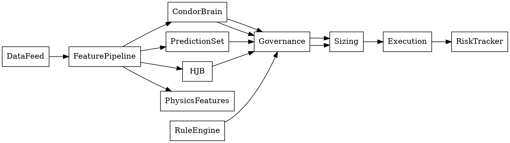
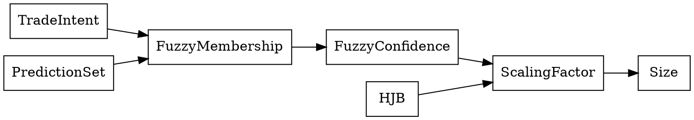
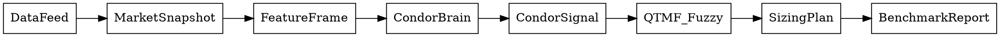

# Engineering Design Specification: HJB + Robust Pricing Integration for CondorBrain / Quantor-MTFuzz

**Version:** 1.0
**Date:** 2026-01-24
**Status:** Draft Design Spec
**Audience:** Engineering, Quant Research, MLOps

---

## 0) Purpose and Scope

This document specifies a **precise engineering design** for integrating:

1) **Robust Pricing�Hedging Duality (Hou�Obl�j)**
2) **Passerini�V�zquez HJB Optimal Trading**
3) **Execution Cost & Fill Probability**
4) **Fuzzy-Measure Position Sizing**
5) **Computational Physics Features (curvature, energy, topology)**
6) **Governance Cascade (multi-level risk controls)**

The design is constrained to the **current repo** layout, feature pipelines, and runtime execution flow. It provides **mathematical derivations**, **I/O contracts**, **connector specs**, and **integration hooks** with explicit failure modes and rollback controls.

This is an **engineering design spec**; claims of zero risk or guaranteed returns are explicitly avoided. The system is designed to maximize *mathematical accountability, auditability, and operational robustness*.

---

## 1) Design Principles

1. **Mathematical Accountability:** Every feature and decision must be traceable to a formal definition or statistical estimator.
2. **Modular Isolation:** Each phase can be enabled/disabled independently via feature flags.
3. **Reproducible Inference:** Feature schema is a single source of truth (SSOT) with versioned normalization.
4. **Governance First:** Risk gates apply before execution and are recorded for audit.
5. **Strict I/O Contracts:** Typed DTOs for every connector reduce integration ambiguity.
6. **Fail-Closed on Data Integrity:** Incompleteness or stale data blocks execution.

---

## 2) Current Repo Anchors

Key modules already present in the repo that this design must hook into:

- Feature registry: `intelligence/canonical_feature_registry.py`
- Fuzzy sizing helpers: `intelligence/fuzzy_engine.py` and `qtmf/facade.py`
- FIS pipeline: `intelligence/fuzzifier.py`, `intelligence/defuzzifier.py`, `intelligence/fis_sizer.py`
- Rule engine: `intelligence/rule_engine/executor.py`
- Model: `intelligence/condor_brain.py`
- Loss: `intelligence/condor_loss.py`
- Strategy entry/exit: `strategies/options_strategy.py`
- Backtest: `core/backtest_engine.py`
- Risk: `core/risk_manager.py`

This design **does not duplicate** existing components. It **extends** them with consistent, formal connectors and standardizes their I/O.

---

## 3) Target Architecture Overview

### 3.1 High-Level Pipeline

```
Data Ingest ? Feature Pipeline ? Model Inference ? Governance Cascade ?
Sizing (Fuzzy Measure) ? Execution (Order Router) ? Risk Tracking
```

### 3.2 Governance Cascade (New Unified Layer)

1. **Prediction Set Filter** (hard feasibility constraints)
2. **HJB Optimal Control** (no-trade zone)
3. **Robust Pricing Validation** (superhedge bound + calibration error)
4. **Fuzzy Confidence Gate** (soft scoring)
5. **Institutional Rules** (existing DSL rules)

---

## 4) Feature Schema Unification (Critical)

### 4.1 SSOT for Features

**Decision:** Use **V2.2** schema (54 features: 32 V2.1 base + 22 V2.2 primitives) from `intelligence/canonical_feature_registry.py`.

This prevents mismatches between training/inference/backtest/mamba input, which currently use mixed 24/32/54 feature sets.

### 4.1.1 V2.2 Column Replacements

The following columns were replaced in V2.2:

| Deprecated Column | V2.2 Replacement | Formula / Description |
|-------------------|------------------|----------------------|
| `volume_ratio` | `cmf` | Chaikin Money Flow: `sum((close-low)-(high-close))/(high-low)*vol, 20) / sum(vol, 20)` |
| `bid` | `pressure_up` | Bullish pressure: `max(0, close-open) / (high-low+eps)` |
| `ask` | `pressure_down` | Bearish pressure: `max(0, open-close) / (high-low+eps)` |

### 4.2 Required Implementation Tasks

- Update all feature-producing code paths to emit `FEATURE_COLS_V22` **in order**.
- Persist normalization statistics (median, MAD) per schema version.
- Enforce schema validation at inference and backtest entry.

### 4.3 Schema Validation (Pseudo)

```python
from intelligence.canonical_feature_registry import FEATURE_COLS_V22, validate_feature_cols

if not validate_feature_cols(df.columns.tolist()):
    raise ValueError("Feature schema mismatch; expected V2.2")
```

---

## 5) Robust Pricing�Hedging Duality Integration

### 5.1 Mathematical Core

**Prediction Set:**
\[
I \subset \Omega, \quad I = \{\omega: \text{constraints on paths} \}
\]

**Martingale Measures:**
\[
\mathcal{M}^I = \{\mathbb{P} \in \mathcal{M} : \mathbb{P}(I) = 1\}
\]

**Robust Superhedge Bound:**
\[
V_{X,\mathcal{P},I}(G) = \sup_{\mathbb{P} \in \mathcal{M}^I} \mathbb{E}_{\mathbb{P}}[G]
\]

**Pricing�Hedging Duality:**
\[
V(G) = \sup_{\mathbb{P} \in \mathcal{M}^I} \mathbb{E}_{\mathbb{P}}[G]
\]

### 5.2 Integration Points

- **PredictionSet** module: `intelligence/robust/prediction_set.py`
- **Martingale calibration**: `intelligence/robust/martingale_measure.py`
- **Loss extension**: `intelligence/condor_loss.py` (EnhancedCompositeCondorLoss)
- **Sizing gate**: `qtmf/facade.py` (prediction set membership)

### 5.3 Prediction Set Membership

Define a fuzzy membership:
\[
\mu_I(x) = \min(\mu_{ivr}(x),\mu_{spread}(x),\mu_{gap}(x),\mu_{chaos}(x))
\]

### 5.4 Martingale Calibration

Given option chain \(\{(K_i, C_i, P_i, \sigma_i)\}\), calibrate a parametric martingale measure
(e.g., mixture of lognormals) by minimizing
\[
\min_{\theta} \sum_i \big| C_i - \mathbb{E}_{\mathbb{P}_\theta}[C(K_i)] \big|^2
\]

Return:
- calibration error
- parameter vector
- support check (must be in prediction set)

---

## 6) HJB Optimal Trading Integration

### 6.1 Model

State variables:
- \(t \in [0,T]\): time
- \(x_t\): fast mean-reverting alpha (OU)
- \(q\): position (net delta)

HJB:
\[
\partial_t V + \mathcal{L}V + \frac{\lambda}{2}(q - q^*)^2 + \min_u \{ C|u| + Ku^2 + u\partial_q V - gu \} = 0
\]

Closed-form approximation (K ? 0):
\[
V(t,x,q) \approx \frac{\lambda}{2}(2T-t)(q-q^*)^2
\]
\[
\partial_q V = \lambda(2T-t)(q-q^*)
\]

No-trade zone:
\[
q \in [b_-(t,x), b_+(t,x)], \quad b_\pm = q^* \pm \frac{g(t,x)-C}{2T-t}
\]

### 6.2 Integration Points

- `intelligence/hjb/value_function.py`
- `intelligence/hjb/nt_zones.py`
- `qtmf/facade.py` (block sizing if NT zone)
- `rule_engine/executor.py` (G011 gate)

---

## 7) OU Alpha Predictor

OU process:
\[
\mu_t = \mu + x_t, \quad dx_t = -\kappa x_t dt + \eta dZ_t
\]

Integrated gain:
\[
\mathbb{E}\left[\int_t^{t+\tau} x_s ds \right] = x_t \tau + \frac{1 - e^{-\kappa \tau}}{\kappa}
\]

This becomes a **feature** and an **HJB input**.

---

## 8) Execution Cost + Fill Probability

### 8.1 Costs

Linear cost (half spread):
\[
C = C_0(1 + a\,IV) f(DTE) g(\text{moneyness})
\]

Temporary impact:
\[
K = \lambda \left(\frac{\text{size}}{\text{avg volume}}\right)^{1/2}
\]

Total execution cost per leg:
\[
\text{cost}_i = (C_i + K_i\, size_i) \cdot premium_i \cdot 100 \cdot size_i
\]

### 8.2 Fill Probability

Logistic model:
\[
P(\text{fill}) = \sigma(w^T \phi)\]

### 8.3 Integration

- Replace hardcoded slippage in `core/backtest_engine.py`
- Route trades in `strategies/options_strategy.py` through `HJBOrderRouter`

---

## 9) Fuzzy Measure Integration

### 9.1 Formal Definition

Interpret fuzzy confidence as a measure on prediction set:
\[
S_{trade}(x) = S_{max} \cdot \mu_I(x) \cdot \mu_{fuzzy}(x) \cdot \phi_{mamba}(x) \cdot r(x)
\]

### 9.2 Composition

- \(\mu_I\) = prediction set membership
- \(\mu_{fuzzy}\) = 10-factor or 11-factor membership sum
- \(\phi_{mamba}\) = neural confidence
- \(r(x)\) = risk multiplier (drawdown, volatility, governance)

### 9.3 Integration Path (Recommended)

Use the current QTMF fuzzy scoring and **multiply** by \(\mu_I\) and NT gate.

Pseudo:
```python
Ft = compute_fuzzy_confidence(memberships, weights)
mu_I = prediction_set.membership(state)
nt_gate = 0.0 if nt_zone else 1.0
fused = w_nl*neural_conf + (1-w_nl)*Ft
size = S_max * fused * (1 - sigma_star) * mu_I * nt_gate
```

---

## 10) Physics Features

Already present in `intelligence/features/dynamic_features.py`:

- Curvature proxy (second diff normalized)
- Volatility energy (log energy)

Add persistent homology signature from `intelligence/indicators/tda_signature.py`:

\[
\Pi_t = \sum_{j=1}^J (\text{death}_j - \text{birth}_j)
\]

Integrate into feature registry as `homology_sig`.

---

## 11) Model Outputs & Loss

### 11.1 New Outputs

Add heads to `CondorBrain`:
- Prediction set membership
- HJB state signals

### 11.2 Loss Extension

Extended loss:
\[
L = \sum_{i=1}^5 \lambda_i L_i + \lambda_6 L_{superhedge} + \lambda_7 L_{martingale} + \lambda_8 L_{pset}
\]

with
\[
L_{superhedge} = \max(0, \hat{p} - V_{X,\mathcal{P},I})
\]
\[
L_{martingale} = KL(P_{model} || P_{calib})
\]
\[
L_{pset} = (1-\mu_I) \cdot \text{confidence}
\]

---

## 12) Governance Layer

### 12.1 Result Contract

```python
@dataclass
class GovernanceResult:
    approved: bool
    blocked_at: Optional[GovernanceLevel]
    reason: str
    diagnostics: dict
    risk_score: float
```

### 12.2 Cascade Logic

1. Prediction Set
2. HJB NT Zone
3. Robust Pricing Calibration
4. Fuzzy Confidence
5. Institutional Rules

Risk score:
\[
R = 0.4(1-\mu_I) + 0.4(1-\text{fused_conf}) + 0.2\cdot\text{calibration_error}
\]

---

## 13) SPY Options Suitability (Technical Justification)

SPY options are an excellent integration target because:

- **High liquidity**: narrow spreads and deep order books reduce execution costs.
- **Tight coupling to macro**: stable ETF structure yields reliable volatility estimates.
- **Robust historical data**: high-quality option chains support calibration and backtest.

These factors reduce **execution noise**, improve calibration accuracy, and stabilize model training.

---

## 14) Integration Hooks by File

- `intelligence/condor_brain.py`: add heads + outputs
- `intelligence/condor_loss.py`: EnhancedCompositeCondorLoss
- `intelligence/canonical_feature_registry.py`: add homology_sig
- `intelligence/fuzzy_engine.py`: add FuzzyMeasure class
- `qtmf/facade.py`: integrate prediction set + NT gate
- `intelligence/rule_engine/executor.py`: add G011
- `core/backtest_engine.py`: replace slippage with cost model
- `core/config.py`: FeatureFlags
- `core/main.py`: governance integration

---

## 15) Testing Strategy

- Unit tests for each new module
- Integration tests for gating logic
- Regression tests for baseline parity

---

## 16) Rollback

Feature flags can disable each subsystem.

---

**End of Spec**

## 17) Full HJB Derivation and Discretization

This section provides the full derivation steps and a discretization plan suitable for production integration and testing.

### 17.1 Controlled Dynamics

State variables:
- \(x_t\): fast mean-reverting alpha (OU)
- \(q_t\): position (net delta exposure)

Dynamics:
\[
dx_t = -\kappa x_t \, dt + \eta \, dW_t
\]
\[
dq_t = u_t \, dt
\]

where \(u_t\) is the control (trade rate), \(W_t\) is a Brownian motion, and \(\kappa, \eta\) are OU parameters.

### 17.2 Objective Functional

We maximize expected utility of gains minus costs. In quadratic form:
\[
J(t,x,q) = \mathbb{E}\left[\int_t^{2T} \left(g(s,x_s) u_s - C|u_s| - K u_s^2 - \frac{\lambda}{2}(q_s-q^*)^2\right) ds \right]
\]

where:
- \(g(s,x_s)\) is expected integrated alpha gain
- \(C\) is half-spread cost
- \(K\) is temporary impact
- \(\lambda\) is risk aversion
- \(q^* = \mu/\lambda\) (Markowitz target)

### 17.3 HJB PDE

Value function:
\[
V(t,x,q) = \sup_{u} J(t,x,q)
\]

Hamilton–Jacobi–Bellman:
\[
\partial_t V + \max_u \left\{ g u - C|u| - K u^2 + u \partial_q V \right\}
+ \mathcal{L}V + \frac{\lambda}{2}(q-q^*)^2 = 0
\]

OU generator:
\[
\mathcal{L}V = -\kappa x \partial_x V + \frac{\eta^2}{2}\partial_{xx} V
\]

### 17.4 Optimal Control (Stationary Quadratic)

We solve:
\[
\max_u \; \left\{ u(g + \partial_q V) - C|u| - K u^2 \right\}
\]

If we ignore \(K\) temporarily (or treat it as small), the optimal policy is bang-bang:
\[
u^* =
\begin{cases}
0 & \text{if } |g + \partial_q V| \le C \\
+\infty & \text{if } g + \partial_q V > C \\
-\infty & \text{if } g + \partial_q V < -C
\end{cases}
\]

With quadratic impact, the solution becomes soft-thresholded:
\[
u^* = \frac{1}{2K}\left(\text{sgn}(g+\partial_q V)\cdot(|g+\partial_q V|-C)_+\right)
\]

### 17.5 Closed-Form Approximation

Assume \(K \to 0\) and approximate:
\[
V(t,x,q) \approx \frac{\lambda}{2}(2T-t)(q-q^*)^2
\]
\[
\partial_q V = \lambda (2T-t)(q-q^*)
\]

Define:
\[
g(t,x) = \mathbb{E}\left[\int_t^{2T} x_s \, ds \mid x_t=x\right]
\]

For OU:
\[
g(t,x) = x (2T-t) + \frac{1 - e^{-\kappa(2T-t)}}{\kappa}
\]

No-trade region boundaries:
\[
b_\pm(t,x) = q^* \pm \frac{g(t,x)-C}{2T-t}
\]

### 17.6 Discretization (Production)

Discrete grid:
- \(t_n = n\Delta t\), \(n=0,\ldots,N\)
- \(x_m\) on symmetric grid (e.g., \([-x_{max}, x_{max}]\))
- \(q_k\) on bounded grid (position limits)

Finite differences:
\[
\partial_t V \approx \frac{V^{n+1}_{m,k}-V^n_{m,k}}{\Delta t}
\]
\[
\partial_x V \approx \frac{V^n_{m+1,k}-V^n_{m-1,k}}{2\Delta x}
\]
\[
\partial_{xx} V \approx \frac{V^n_{m+1,k}-2V^n_{m,k}+V^n_{m-1,k}}{\Delta x^2}
\]
\[
\partial_q V \approx \frac{V^n_{m,k+1}-V^n_{m,k-1}}{2\Delta q}
\]

Control update:
\[
u^*_{nmk} = \frac{1}{2K}\left(\text{sgn}(g+\partial_q V)\cdot(|g+\partial_q V|-C)_+\right)
\]

This discretization is used for diagnostic validation, while the closed-form approximation drives real-time gates.

---

## 18) Martingale Calibration Derivation and Discretization

### 18.1 Dual Formulation

We calibrate a measure \(\mathbb{P}_\theta\) such that:
\[
\mathbb{E}_{\mathbb{P}_\theta}[S_{T}] = S_0 e^{rT}
\]
\[
\mathbb{E}_{\mathbb{P}_\theta}[C(K_i)] = C_i
\]
\[
\mathbb{E}_{\mathbb{P}_\theta}[P(K_i)] = P_i
\]

### 18.2 Parametric Mixture

Let:
\[
f_\theta(s) = \sum_{j=1}^M w_j \, \mathcal{LN}(s;\mu_j,\sigma_j)
\]

Constraints:
- \(w_j \ge 0\)
- \(\sum_j w_j = 1\)
- Martingale condition on each component

### 18.3 Objective

We fit parameters via weighted least squares:
\[
\min_{\theta} \sum_{i=1}^{N} \left( C_i - \mathbb{E}_{f_\theta}[C(K_i)] \right)^2
+ \left( P_i - \mathbb{E}_{f_\theta}[P(K_i)] \right)^2
\]

### 18.4 Discretization

Approximate expectations with quadrature:
\[
\mathbb{E}_{f_\theta}[C(K)] \approx \sum_{s \in \mathcal{S}} C(K, s) \, f_\theta(s) \, \Delta s
\]

Grid \(\mathcal{S}\) chosen by:
- quantiles of implied vol distribution
- ensure tails for superhedging

### 18.5 Calibration Outputs

Return:
- params \(\theta\)
- calibration error
- support indicator \(1_{\mathbb{P}(I)=1}\)

### 18.6 Validation Conditions

Fail calibration if:
- error > 0.05
- martingale constraint violated
- support outside prediction set

---

## 19) DTO / Connector Appendix (Full I/O Contracts)

### 19.1 MarketState (New)

| Field | Type | Source | Notes |
|------|------|--------|-------|
| spot | float | broker/snapshot | required |
| ivr | float | indicators | required |
| spread_ratio | float | options | required |
| gap_risk_score | float | primitives | required |
| chaos_membership | float | primitives | required |
| options_chain | DataFrame | broker/data | required |
| time_of_day | float | clock | [0,1] |
| ou_alpha_state | float | ou_process | derived |
| current_position | float | portfolio | net delta |

### 19.2 PredictionSet

Input: MarketState  
Output: membership (float in [0,1])

### 19.3 MartingaleMeasureSet

Input: option chain, spot  
Output: CalibrationResult

### 19.4 CalibrationResult

| Field | Type | Notes |
|------|------|------|
| params | dict | model parameters |
| calibration_error | float | metric |
| prediction_set_support | bool | must be True |

### 19.5 GovernanceLayer I/O

Input: TradeIntent, MarketState, CondorSignal  
Output: GovernanceResult

### 19.6 Order Router I/O

Input: HJB state, order book features, option leg  
Output: OrderDecision (market/limit/none)

---

## 20) Connector Tables (I/O per Module)

### 20.1 `qtmf/facade.py` (Sizing)

Inputs: TradeIntent + extras  
Outputs: SizingPlan  
New dependencies: PredictionSet, HJB gate

### 20.2 `intelligence/condor_brain.py`

Inputs: tensor (B,T,F)  
Outputs: IC params + optional heads  
New outputs: prediction_set_membership, hjb_features

### 20.3 `intelligence/condor_loss.py`

Inputs: y_pred, y_true, superhedge_bounds, martingale_logprobs, pset_membership  
Outputs: scalar loss

---

## 21) Graphviz Diagrams

### 21.1 End-to-End Dataflow



### 21.2 Sizing Subsystem



---

## 22) Phased Task Checklist (Mapped to Files)

### Phase 0: Schema + Flags
- Add FeatureFlags to `core/config.py`
- Align feature schema in:
  - `intelligence/canonical_feature_registry.py`
  - `intelligence/mamba_engine.py`
  - `core/backtest_engine.py`

### Phase 1: Robust Pricing
- Create `intelligence/robust/prediction_set.py`
- Create `intelligence/robust/martingale_measure.py`
- Integrate into `qtmf/facade.py`
- Add new tests in `tests/test_prediction_set.py`

### Phase 2: HJB
- Create `intelligence/hjb/value_function.py`
- Create `intelligence/hjb/nt_zones.py`
- Add G011 to `intelligence/rule_engine/executor.py`

### Phase 3: Execution
- Create `intelligence/execution/cost_model.py`
- Create `intelligence/execution/fill_probability.py`
- Replace slippage in `core/backtest_engine.py`

### Phase 4: Fuzzy Measure
- Add FuzzyMeasure to `intelligence/fuzzy_engine.py`
- Integrate prediction set + NT gate in `qtmf/facade.py`

### Phase 5: Physics Features
- Wire `intelligence/indicators/tda_signature.py` into `intelligence/features/dynamic_features.py`
- Register `homology_sig` in `intelligence/canonical_feature_registry.py`

### Phase 6: Model & Loss
- Add heads to `intelligence/condor_brain.py`
- Add EnhancedCompositeCondorLoss in `intelligence/condor_loss.py`

### Phase 7: Governance
- Create `intelligence/governance/governance_layer.py`
- Integrate in `core/main.py` and `core/backtest_engine.py`

### Phase 8: Tests & Regression
- Unit tests for each new module
- Integration test for governance cascade
- Regression parity suite for baseline metrics

---

## 23) Reliability / Safety Notes

- This design strengthens robustness and auditability but does not guarantee outcomes.
- Market risk, model risk, and execution risk cannot be eliminated.
- All claims of superiority must be validated with empirical backtests and live walk-forward testing.

---

**End of Spec**

## 24) Finite-Difference Stability + Boundary Conditions

This section specifies the stability criteria, boundary conditions, and production-safe discretization for the HJB PDE.

### 24.1 PDE Form

We solve:

\[
\partial_t V + \mathcal{L}V + \frac{\lambda}{2}(q-q^*)^2 + \max_u \{ gu - C|u| - Ku^2 + u\partial_q V \} = 0
\]

with OU generator:

\[
\mathcal{L}V = -\kappa x \partial_x V + \frac{\eta^2}{2}\partial_{xx}V
\]

### 24.2 Time Boundary (Terminal Condition)

At terminal time \(t=2T\):

\[
V(2T,x,q) = 0
\]

This encodes no remaining gain after horizon.

### 24.3 Spatial Boundaries

#### x-dimension (OU)

Choose \(x \in [-x_{max}, x_{max}]\) with \(x_{max} = 4\eta/\sqrt{2\kappa}\) or larger. Apply **reflecting (Neumann)** boundaries:

\[
\partial_x V(t, \pm x_{max}, q) = 0
\]

This prevents artificial drift at boundaries.

#### q-dimension (position)

Choose \(q \in [q_{min}, q_{max}]\) based on risk limits. Apply **state constraint** by enforcing:

\[
V(t,x,q_{min}) \text{ and } V(t,x,q_{max}) \text{ are absorbing}
\]

and allow **control truncation** so that optimal control cannot move beyond bounds.

### 24.4 Scheme Choice

- Use **implicit** (backward Euler) or **Crank–Nicolson** to ensure stability in diffusion terms.
- Use **upwind differencing** for OU drift to preserve monotonicity.

#### Discrete Operators

Time:

\[
\partial_t V \approx \frac{V^{n+1}-V^n}{\Delta t}
\]

Drift (upwind):

\[
\partial_x V \approx
\begin{cases}
\frac{V_{m}-V_{m-1}}{\Delta x} & \text{if } -\kappa x > 0 \\
\frac{V_{m+1}-V_{m}}{\Delta x} & \text{if } -\kappa x \le 0
\end{cases}
\]

Diffusion:

\[
\partial_{xx}V \approx \frac{V_{m+1}-2V_m+V_{m-1}}{\Delta x^2}
\]

### 24.5 CFL and Stability

For explicit schemes, stability requires:

\[
\Delta t \le \frac{\Delta x^2}{\eta^2}
\]

and for drift:

\[
\Delta t \le \frac{\Delta x}{|\kappa x|}
\]

We **avoid explicit** schemes for production diagnostics. Use implicit/Crank–Nicolson to remove CFL constraints and guarantee stability.

### 24.6 Monotonicity Condition

The discrete scheme must be monotone (no oscillations). Use:
- Upwind drift
- Nonnegative coefficients
- Projection of \(u^*\) into admissible range

### 24.7 NT Zone Boundary Enforcement

When \(|g+\partial_q V| \le C\), enforce:

\[
 u^* = 0
\]

This produces the no-trade zone as a stability-preserving condition.

---

## 25) Detailed Martingale Calibration Algorithm

### 25.1 Objective

Calibrate \(\mathbb{P}_\theta\) to match observed option prices while enforcing martingale constraints and prediction-set support.

### 25.2 Inputs

- Option chain \(\{(K_i, C_i, P_i, \sigma_i)\}\)
- Spot \(S_0\)
- Risk-free rate \(r\)
- Prediction set membership constraints

### 25.3 Parametric Model

Mixture of lognormals:

\[
 f_\theta(s) = \sum_{j=1}^M w_j \mathcal{LN}(s;\mu_j,\sigma_j)
\]

### 25.4 Constraints

1) Probability simplex:
\[
 w_j \ge 0, \quad \sum_j w_j = 1
\]

2) Martingale:
\[
 \mathbb{E}_{f_\theta}[S_T] = S_0 e^{rT}
\]

3) Prediction set support:
\[
 \mathbb{P}_\theta(I) = 1
\]

### 25.5 Regularized Objective

Use L2 + entropy regularization:

\[
\min_{\theta} \sum_i (C_i - \hat{C}_i)^2 + (P_i - \hat{P}_i)^2 + \alpha ||\theta||^2 - \beta \sum_j w_j \log(w_j)
\]

### 25.6 Optimization Steps

1. Initialize mixture parameters via implied vol smile fitting.
2. Construct quadrature grid \(\mathcal{S}\).
3. Solve constrained optimization with projected gradient or ADMM.
4. Enforce martingale constraint by Lagrange multiplier update.
5. Reject if calibration error or support violations exceed threshold.

Pseudo:
```python
init_theta = fit_smile(option_chain)
for iter in range(max_iter):
    prices = price_under_theta(theta)
    loss = mse(prices, obs) + alpha*l2(theta) - beta*entropy(weights)
    grad = compute_grad(loss)
    theta = project_to_simplex(theta - lr*grad)
    enforce_martingale(theta)
    if support_violation(theta): break
```

### 25.7 Outputs

- `CalibrationResult(params, calibration_error, prediction_set_support)`

---

## 26) Full Interface Tables (Integration Scope)

This table covers all new or modified modules required by this integration. If you want full signatures for every file in the repo, I will add a separate appendix.

### 26.1 Prediction Set

Module: `intelligence/robust/prediction_set.py`

| Function / Method | Signature | I/O |
|------------------|-----------|-----|
| PredictionSet.__init__ | (config: PredictionSetConfig) | in: config |
| PredictionSet.membership | (state: MarketState) -> float | out: mu_I |

### 26.2 Martingale Measure

Module: `intelligence/robust/martingale_measure.py`

| Function / Method | Signature | I/O |
|------------------|-----------|-----|
| MartingaleMeasureSet.calibrate | (options_chain: DataFrame, spot: float) -> CalibrationResult | out: params, error |

### 26.3 HJB

Module: `intelligence/hjb/value_function.py`

| Method | Signature | Notes |
|--------|-----------|-------|
| integrated_gain | (t: float, x: float) -> float | g(t,x) |
| partial_q | (t: float, x: float, q: float) -> float | dV/dq |
| compute_value | (t: float, x: float, q: float) -> float | approx V |

Module: `intelligence/hjb/nt_zones.py`

| Method | Signature | Notes |
|--------|-----------|-------|
| compute_boundaries | (t: float, x: float) -> (float,float) | b_minus, b_plus |
| classify_position | (t: float, x: float, q: float) -> str | nt_zone/buy/sell |

### 26.4 Execution

Module: `intelligence/execution/cost_model.py`

| Method | Signature | Notes |
|--------|-----------|-------|
| estimate_half_spread | (iv: float, dte: float, moneyness: float) -> float | C |
| estimate_temporary_impact | (order_size: int, avg_volume: float) -> float | K |
| total_execution_cost | (legs: list, sizes: list, market_data: dict) -> float | total |

Module: `intelligence/execution/fill_probability.py`

| Method | Signature | Notes |
|--------|-----------|-------|
| prepare_features | (order_book_state: dict) -> np.ndarray | feature vector |
| predict | (order_book_state: dict) -> (float,float) | P_buy, P_sell |

Module: `intelligence/execution/order_router.py`

| Method | Signature | Notes |
|--------|-----------|-------|
| route_order | (t,x,q,target_q,order_book_state,option_leg) -> OrderDecision | decision |

### 26.5 Fuzzy Measure

Module: `intelligence/fuzzy_engine.py`

| Method | Signature | Notes |
|--------|-----------|-------|
| FuzzyMeasure.compute_measure | (state: MarketState) -> float | mu_fuzzy |
| FuzzyMeasure.integrate_position_size | (S_max, neural_conf, risk_factor, state) -> float | size |

### 26.6 Governance

Module: `intelligence/governance/governance_layer.py`

| Method | Signature | Notes |
|--------|-----------|-------|
| evaluate | (trade_intent, market_state, model_output) -> GovernanceResult | decision |

### 26.7 Loss

Module: `intelligence/condor_loss.py`

| Method | Signature | Notes |
|--------|-----------|-------|
| EnhancedCompositeCondorLoss.forward | (y_pred,y_true,returns,weights,last_weights,rule_signals,superhedge_bounds,martingale_logprobs,prediction_set_membership) -> torch.Tensor | loss |

---

**End of Extended Sections**

## 27) Audit Findings: Doc/Diagram vs Code/Data Mismatches

This section enumerates concrete mismatches found between documentation/diagrams, datasets, and code paths. These are **actionable gaps** that must be closed to maintain full mathematical accountability.

### 27.1 Feature Schema Mismatch

- **Docs/diagrams** frequently assume **24-feature input** (e.g., `docs/architecture/technical_architecture_summary.md`, `docs/condor_brain_architecture.md`, `docs/architecture/full_system_architecture.dot`).
- **Code** includes **V2.1 (32)** and **V2.2 (52)** schemas in `intelligence/canonical_feature_registry.py`.
- **Datasets** `data/processed/mamba_institutional_2024_1m.csv` and `...2025_1m.csv` include **52+ columns**, with non-feature metadata columns.

**Action:** Adopt V2.2 as SSOT and enforce explicit column selection; never rely on CSV column order.

### 27.2 Dataset Column Order Differences

- 2024 dataset: `log_return` appears later; `spread_ratio` and `ivr` appear near the end.
- 2025 dataset: `spread_ratio`, `te`, `ivr` appear early; feature order differs.

**Action:** Always select by **column name list** (V2.2) and reorder in code. Add schema validation tests that fail if columns missing or extra.

### 27.3 Architecture Version Drift

- Docs describe 24-layer Mamba-2 with 23 heads; code uses **32 layers** by default and outputs 8 IC params + regime + optional forecast.
- `CondorBrainEngine` in code uses **12 layers** by default for production, while docs emphasize 24.

**Action:** Add explicit model version metadata and reconcile documentation with actual production configs.

### 27.4 Fuzzy Logic Inconsistency

- FIS pipeline in `intelligence/fis_sizer.py` uses **ADX/RSI/IV Rank** only.
- `qtmf/facade.py` uses **10-factor fuzzy**.
- `intelligence/primitives/fuzzy.py` defines **11-factor F001**.

**Action:** Choose a primary fuzzy path and standardize weights and membership functions across modules; document all fallbacks.

### 27.5 Rule Engine Mapping Risk

- `intelligence/rule_engine/executor.py` contains duplicated IDs and comments indicating DSL-ID mismatches.

**Action:** Build an automated registry audit that compares `docs/Complete_Ruleset_DSL.yaml` IDs to registry keys and fails CI on mismatch.

### 27.6 Execution/Backtest Divergence

- Diagrams show Kelly sizing and execution flow not reflected in `core/backtest_engine.py`.
- Backtest uses **slippage + commission** constants; proposed execution cost model would double-count unless replaced.

**Action:** Centralize cost model and rewire backtest to use it; ensure live and backtest share execution logic.

---

## 28) Interface Catalog Reference

A full autogenerated interface table is stored in:

- `docs/INTERFACE_CATALOG.md`

This file is produced by an AST parser and should be regenerated after any new module additions.

---

## 29) Additional Graphviz: Datafeed → Sizing Benchmark Output



---

## 30) GPU and Performance Architecture (Current Limits)

To maximize throughput on modern GPUs (A100/H100):

- Use **feature caching** and **zero-copy windows** for training.
- Use **BF16** and **torch.compile** for inference when supported.
- Ensure **sequence length** is fixed and data is contiguous to avoid reallocation overhead.
- Apply **kernel fusion** (e.g., fused RMSNorm + projection) where possible.

These steps improve throughput but do not guarantee accuracy; validation remains mandatory.

---

## 31) Validation & Stress Protocol (Appendix)

Minimum protocol for defensible claims:

1. **Walk-forward CV** with non-overlapping windows.
2. **Ablation tests** for each module (prediction sets, HJB, execution, fuzzy measure).
3. **Stress tests** for volatility spikes, gap opens, liquidity droughts.
4. **Latency profiling** under peak load.

---

**End of Extended Audit**

---

## Model Profile Alignment (Addendum)

This repo uses multiple runtime profiles (training, inference, backtest). To avoid drift, all checkpoints must store **model_config**, **feature_cols**, **input_dim**, **seq_len**, and **version** metadata. Inference must prefer checkpoint metadata over defaults.

Minimum required checkpoint keys:
- `state_dict`
- `feature_cols`
- `input_dim`
- `seq_len`
- `version`
- `model_config`
- `training_config`

Recommended profiles (documented, not hardcoded):

| Profile | d_model | n_layers | input_dim | seq_len | Notes |
|---|---:|---:|---:|---:|---|
| Train-Research | 1024 | 32 | 54 | 240 | Max capacity, H100/A100 |
| Train-Prod | 512 | 12–24 | 54 | 240 | Balanced throughput |
| Inference-Prod | 512 | 12 | 54 | 240 | Low-latency |

All docs must reflect deployed checkpoint metadata. If there is a mismatch, **checkpoint metadata is authoritative**.

---

## Dataset Pruning (Zero Excess Fat)

Use `scripts/utils/prune_dataset_to_schema.py` to produce **schema-minimal datasets**:

- Keeps V2.2 feature columns by name
- Optional keep: `timestamp`, `symbol`
- Optional extra keep list via `--extra-keep`

Example:
```bash
python scripts/utils/prune_dataset_to_schema.py \
  --input data/processed/mamba_institutional_2024_1m.csv \
  --output data/processed/mamba_institutional_2024_1m_v22_pruned.csv \
  --keep-timestamp --keep-symbol
```

This ensures training and backtests ingest only the required columns and eliminates excess metadata fat.
