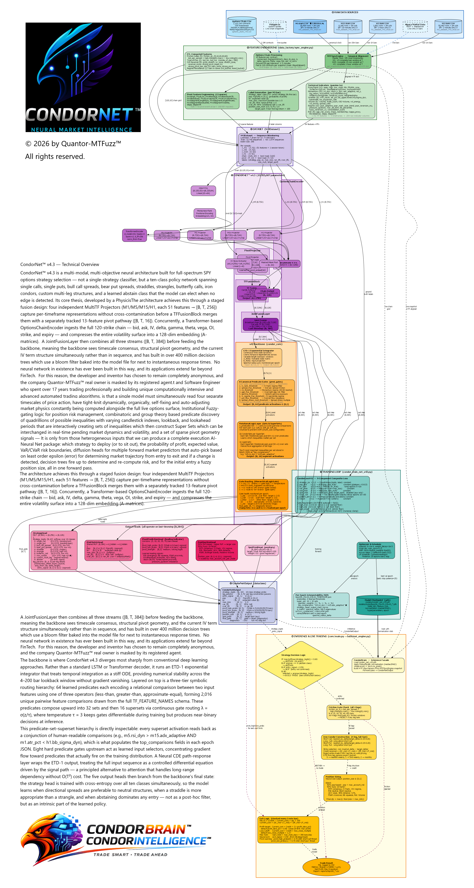

# CondorBrain Architecture (v4.3 - CondorNet™)

This document visualizes the **CondorBrain v4.3** model architecture. It features the novel **CondorNet™ v4.3** unified architecture, extending the v4.0 ETD-1/CDE/TFT core with multi-timeframe fusion, options chain encoding, pivot prediction, and multi-strategy intelligence.

> **Architecture Evolution:**
> - v1.x: TFT (Temporal Fusion Transformer) - Failed to converge
> - v2.x: Mamba-2 SSM - NaN explosions during training
> - v3.x: Neural CDE - Overfitting, insufficient for complex regime dynamics
> - v4.0: CondorNet™ - Unified fusion of all three paradigms with ETD-1 stability
> - **v4.3: CondorNet™ v4.3** - Multi-TF × Chain × Pivot intelligence, 10 strategy types, 10.9M params

## CondorNet™ v4.3 Data Fusion Pipeline

The core innovation of v4.3 is the multi-source data fusion pipeline that combines 4 timeframes, options chain data, and pivot features into a unified 384-dim joint representation:

### Step 1: Multi-Timeframe Projection

$$z_{\text{joint}} = [\text{proj}_{M1}(x_{M1}); \text{proj}_{M5}(x_{M5}); \text{proj}_{M15}(x_{M15}); \text{proj}_{H1}(x_{H1})] \in \mathbb{R}^{B \times T \times 256}$$

Each TF gets its own linear projection (64 → 64 per TF, concatenated to 256) with LayerNorm + GELU activation.

### Step 2: Pivot Fusion

$$z_{\text{fused}} = \text{LayerNorm}(\text{Linear}(z_{\text{joint}} \| \text{PivotProj}(p)) + z_{\text{joint}}) \in \mathbb{R}^{B \times T \times 256}$$

Where PivotProj maps 13 sparse pivot features → 16-dim dense embedding with NaN masking.

### Step 3: Options Chain Encoding

$$c = \text{FinalProj}(\text{OutputProj}(\text{MaskedMeanPool}(\text{TransformerEnc}(\text{ChainGrid}))) \| \text{SkewProj}(\sigma_{\text{put}} - \sigma_{\text{call}})) \in \mathbb{R}^{B \times 128}$$

Transformer encoder (2 layers, 4 heads, d_model=64) over moneyness-ranked chain grid with skew signal extraction.

### Step 4: Joint Fusion

$$j = \text{LayerNorm}(z_{\text{fused}} \| \text{broadcast}(c)) \in \mathbb{R}^{B \times T \times 384}$$

## ETD-1 Core Evolution Equation

The v4.2 core engine (preserved in v4.3) operates on the fused representation:

$$x_k = e^{A_\theta(u_k)\Delta t_k} x_{k-1} + \Delta t_k \varphi_1(A_\theta(u_k)\Delta t_k) B_\theta(u_k) + G_\theta(x_{k-1}, u_k) \Delta X_k + D(\text{Greeks}_k, r_{k-1}, q_k)$$

Where:
- **φ₁(M) = M⁻¹(e^M - I)** is the ETD-1 basis function
- **x_k = [h_k; v_k; m_k; r_k]** is the 4-block augmented state
- **u_k = TFT(X_{1:k})** is the control embedding from Temporal Fusion Transformer
- **G_θ(x, u) · ΔX_k** is the Neural CDE path-dependent response
- **D(Greeks, r, q)** is the full 4-block forcing term

## 4-Block Augmented State

| Block | Symbol | Dimension | Description |
|-------|--------|-----------|-------------|
| Latent Risk Manifold | h_k | d_h = 256 | Hidden state capturing market dynamics |
| Portfolio State | v_k | d_v = 32 | Greeks, P&L, position information |
| Risk Memory | m_k | d_m = 64 | Running max drawdown, VaR, stress integrals |
| Regime Combinatorics | r_k | d_r = 32 | Explicit regime state from predicate gates |

## Architecture Diagram

## Key Components

### 1. MultiTFProjector (v4.3 NEW)

Projects 4 independent timeframe feature tensors to a shared joint representation:
- **Input**: 4 × [B, T, 64] (M1, M5, M15, H1)
- **Output**: [B, T, 256] (64 per TF, concatenated)
- Tracks per-TF contribution ratios via Frobenius norms

### 2. PivotProjector + TFFusionBlock (v4.3 NEW)

Projects sparse pivot features into dense embeddings and fuses with TF representation:
- **PivotProjector**: [B, T, 13] → [B, T, 16] with NaN masking and learned no-pivot embedding
- **TFFusionBlock**: cat([TF_256, Pivot_16]) → Linear(272→256) + LayerNorm + residual

### 3. OptionsChainEncoder (v4.3 NEW)

Transformer encoder over the full options chain grid:
- **Input**: [B, N_contracts, 10] with moneyness-ranked positional encoding
- **Architecture**: 2-layer Transformer (4 heads, d_model=64, d_ff=256, pre-norm)
- **Pooling**: Masked mean pooling (ignores padded/illiquid contracts)
- **Skew Signal**: put_iv_25δ − call_iv_25δ → 8-dim projection
- **Output**: [B, d_chain=128]

### 4. JointFusionLayer (v4.3 NEW)

Combines fused TF representation with chain embedding:
- Chain embed [B, 128] → broadcast → [B, T, 128]
- Concatenate: [B, T, 256+128] = [B, T, 384]
- LayerNorm → dropout → output

### 5. ETD-1 Exponential Integrator (v4.2 Core — Preserved)

$$F_k = e^{A_\theta(u_k) \Delta t_k}$$
$$g_k = \Delta t_k \cdot \varphi_1(A_\theta \Delta t_k) \cdot B_\theta(u_k)$$

### 6. Neural CDE Response (v4.2 Core — Preserved)

$$\text{CDE}_k = G_\theta(x_{k-1}, u_k) \cdot \Delta X_k$$

### 7. Eight Predicate Gates (v4.3 — Extended from 5)

| # | Predicate | Condition | Description |
|---|-----------|-----------|-------------|
| 1 | **IV Rank Threshold** | IVR_t > threshold | Elevated implied volatility |
| 2 | **Spread Ratio** | Spread/Price > 0.4% | Wide bid-ask spreads |
| 3 | **RSI Signal** | RSI < 25 | Oversold conditions |
| 4 | **Delta RSI** | ΔRSI < 0 | Declining momentum |
| 5 | **Momentum Reversal** | RSI < 25 ∧ ΔRSI < 0 | Compound reversal signal |
| 6 | **Gap Risk** | \|ΔS\|/S > 1.2% | Large price gaps |
| 7 | **Greeks Pressure** | \|Γ\| > threshold | High gamma exposure |
| 8 | **IV Regime Fraction** | IV regime signal | Regime transition indicator |

### 8. Regime Combinatorics (r_k Dynamics)

$$r_k = \alpha_k \odot r_{k-1} + \beta_k$$

Where:
- α_k = σ(W_α · z_pred) is a forget gate
- β_k = W_β · z_pred is the update term
- z_pred = [p; moments; bloom] is the predicate signature

## Output Specification (v4.3 Multi-Head)

### Strategy Head
| Output | Shape | Range | Purpose |
|--------|-------|-------|---------|
| `strategy_logits` | [B, 10] | raw | Logits over 10 strategy types |
| `leg_params` | [B, 4, 5] | varies | Per-leg: moneyness_offset, expiry_bucket, long_short, qty, delta_target |
| `entry_signal` | [B, 1] | [0,1] | Entry confidence (sigmoid) |

### Risk Metric Head
| Output | Shape | Range | Purpose |
|--------|-------|-------|---------|
| `pop` | [B, 1] | [0,1] | Probability of Profit |
| `ev` | [B, 1] | unbounded | Expected Value ($) |
| `max_loss` | [B, 1] | ≥ 0 | Maximum loss (softplus) |
| `var_95` | [B, 1] | ≥ 0 | 95% Value at Risk |
| `cvar_95` | [B, 1] | ≥ VaR₉₅ | 95% Conditional VaR |

### Pivot Prediction Head
| Output | Shape | Range | Purpose |
|--------|-------|-------|---------|
| `pivot_high_probs` | [B, 5] | [0,1] | P(pivot_high at [5,10,20,35,70] bars) |
| `pivot_low_probs` | [B, 5] | [0,1] | P(pivot_low at [5,10,20,35,70] bars) |
| `pivot_strength` | [B, 2] | raw | Medium vs strong logits |

### Position Sizing
| Output | Shape | Range | Purpose |
|--------|-------|-------|---------|
| `position_size` | [B, 1] | [0,1] | PoP-blended fuzzy sizing (50/50 blend) |
| `spot_pred` | [B, 1] | unbounded | Target spot price prediction |

## 10 Strategy Types

| Index | Strategy | Legs | Description |
|-------|----------|------|-------------|
| 0 | `single_call` | 1 | Directional long call |
| 1 | `single_put` | 1 | Directional long put |
| 2 | `bull_call_spread` | 2 | Defined-risk bullish |
| 3 | `bear_put_spread` | 2 | Defined-risk bearish |
| 4 | `straddle` | 2 | Neutral volatility play |
| 5 | `strangle` | 2 | Wide neutral volatility |
| 6 | `butterfly_call` | 3 | Low-vol directional |
| 7 | `iron_condor` | 4 | Range-bound premium selling |
| 8 | `custom_multi_leg` | varies | Flexible multi-leg |
| 9 | `abstain` | 0 | No trade signal (confidence < 0.60) |

## Why CondorNet™ v4.3 Extends v4.0

| Architecture Gap | v4.0 Limitation | v4.3 Solution |
|-----------------|-----------------|---------------|
| **Single TF input** | Only M5 features, no cross-TF context | **4× TF projectors** with contribution tracking |
| **No options data** | Blind to chain surface structure | **OptionsChainEncoder** with skew extraction |
| **Iron Condor only** | Fixed to single strategy type | **10 strategy types** with leg parameterization |
| **No risk metrics** | Confidence only | **PoP, EV, MaxLoss, VaR₉₅, CVaR₉₅** |
| **No pivot prediction** | Reactive only | **PivotPredictionHead** at 5 horizons |
| **5 predicates** | Limited regime awareness | **8 predicate gates** with extended regime logic |

---

## Repository Sync Addendum (2026-02-24)

This document is part of the synchronized documentation set. The authoritative implementation spec is:

- `intelligence/condor_brain_net_v43.py` (primary architecture)
- `intelligence/schema_v43.py` (feature schema and strategy types)
- `docs/CONDORNET_IMPLEMENTATION_PLAN.md` (implementation spec)

If this document conflicts with the code, the code governs implementation.

---

*Document Version: 4.3 (CondorNet™) | Last Updated: 2026-02-24*
*© 2026 CondorBrain™ Differential Intelligence*
