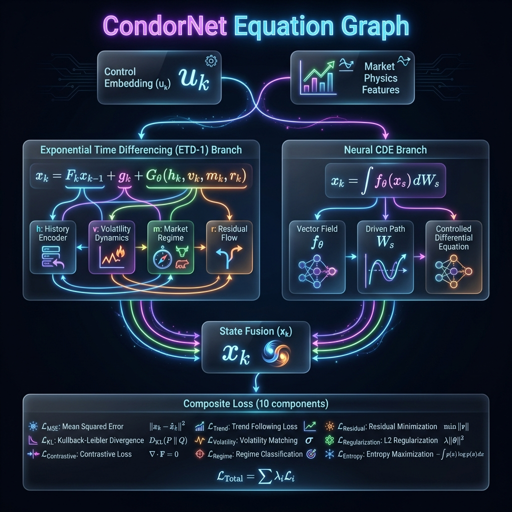

# CondorBrain Architecture (v4.0 - CondorNet™)

This document visualizes the **CondorBrain v4.0** model architecture. It features the novel **CondorNet™** unified architecture, fusing ETD-1 exponential integration, Neural CDE path response, TFT control synthesis, and predicate-based regime dynamics.

> **Architecture Evolution:**
> - v1.x: TFT (Temporal Fusion Transformer) - Failed to converge
> - v2.x: Mamba-2 SSM - NaN explosions during training
> - v3.x: Neural CDE - Overfitting, insufficient for complex regime dynamics
> - **v4.0: CondorNet™** - Unified fusion of all three paradigms with ETD-1 stability

## CondorNet™ Master Equation

The core innovation is the unified evolution equation that mathematically fuses TFT control synthesis, Neural CDE path response, and Mamba/SSD time evolution with the ETD-1 exponential integrator:

$$
x_k = e^{A_\theta(u_k)\Delta t_k} x_{k-1} + \Delta t_k \varphi_1(A_\theta(u_k)\Delta t_k) B_\theta(u_k) + G_\theta(x_{k-1}, u_k) \Delta X_k + D(\text{Greeks}_k, r_{k-1}, q_k)
$$

Where:
- **φ₁(M) = M⁻¹(e^M - I)** is the ETD-1 basis function
- **x_k = [h_k; v_k; m_k; r_k]** is the 4-block augmented state
- **u_k = TFT(X_{1:k})** is the control embedding from Temporal Fusion Transformer
- **G_θ(x, u) · ΔX_k** is the Neural CDE path-dependent response
- **D(Greeks, r, q)** is the full 4-block forcing term

## 4-Block Augmented State

| Block | Symbol | Dimension | Description |
|-------|--------|-----------|-------------|
| Latent Risk Manifold | h_k | d_h = 256 | Hidden state capturing market dynamics |
| Portfolio State | v_k | d_v = 32 | Greeks, P&L, position information |
| Risk Memory | m_k | d_m = 64 | Running max drawdown, VaR, stress integrals |
| Regime Combinatorics | r_k | d_r = 32 | Explicit regime state from predicate gates |

## Architecture Diagram

## Key Components

### 1. TFT Control Synthesis (Region I)

The Temporal Fusion Transformer provides the control embedding u_k that modulates all other components:

$$u_k = \text{TFT}_\theta(X_{1:k})$$

**Purpose:** Captures long-range temporal dependencies and provides context-aware control signals.

### 2. ETD-1 Exponential Integrator (Region III)

Unlike simple Euler discretization, CondorNet uses the **Exponential Time Differencing (ETD-1)** scheme:

$$F_k = e^{A_\theta(u_k) \Delta t_k}$$
$$g_k = \Delta t_k \cdot \varphi_1(A_\theta \Delta t_k) \cdot B_\theta(u_k)$$

**Why ETD-1 Over Euler:**
| Aspect | Euler | ETD-1 |
|--------|-------|-------|
| Stability | Requires small Δt | Stable for all Δt |
| Accuracy | O(Δt) | O(Δt²) effective |
| Stiffness | Fails on stiff systems | Handles stiffness |

### 3. Neural CDE Response (Region II)

The CDE component provides path-dependent response:

$$\text{CDE}_k = G_\theta(x_{k-1}, u_k) \cdot \Delta X_k$$

**Mathematical Formulation:**
- G_θ ∈ ℝ^{d_x × F} is a learned response matrix
- ΔX_k = X_k - X_{k-1} is the control path increment
- The product captures how market movements drive state evolution

### 4. Five Canonical Predicate Gates

The predicate system implements differentiable inequality gates:

| Predicate | Condition | Description |
|-----------|-----------|-------------|
| **Volatility Spike** | IVR_t > 75 | Elevated implied volatility |
| **Liquidity Compression** | Spread/Price > 0.4% | Wide bid-ask spreads |
| **Momentum Reversal** | RSI < 25 ∧ ΔRSI < 0 | Oversold with declining momentum |
| **Gap Risk** | \|ΔS\|/S > 1.2% | Large price gaps |
| **Greeks Pressure** | \|Γ\| > threshold | High gamma exposure |

### 5. Regime Combinatorics (r_k Dynamics)

The explicit regime state evolves via:

$$r_k = \alpha_k \odot r_{k-1} + \beta_k$$

Where:
- α_k = σ(W_α · z_pred) is a forget gate
- β_k = W_β · z_pred is the update term
- z_pred = [p; moments; bloom] is the predicate signature

### 6. Full 4-Block Forcing D

The forcing term affects all four state blocks:

$$D(Greeks_k, r_{k-1}, q_k) = [D_h; D_v; D_m; D_r]$$

| Block | Forcing Semantics |
|-------|-------------------|
| D_h | Market physics from Greeks + regime |
| D_v | Execution (slippage, impact, margin) |
| D_m | Cumulative risk (stress integrals) |
| D_r | Regime forcing from predicates |

**Critical:** Uses r_{k-1} (previous regime) for causality!

## Output Specification (10 Parameters)

| Index | Output | Range | Purpose |
|-------|--------|-------|---------|
| 0 | `short_call_offset` | 0-5% | ATM distance for short call |
| 1 | `short_put_offset` | 0-5% | ATM distance for short put |
| 2 | `wing_width` | 0-$10 | Long strike offset |
| 3 | `dte_selection` | 2-45 days | Optimal days to expiry |
| 4 | `prob_profit` | 0-1 | Estimated win probability |
| 5 | `expected_roi` | -50% to +50% | Return on risk |
| 6 | `max_loss_pct` | 0-1 | Max loss fraction |
| 7 | `confidence` | 0-1 | Model certainty |
| 8 | `entry_logit` | raw | Entry signal |
| 9 | `exit_logit` | raw | Exit signal |

## Composite Loss Function

CondorNet uses a 10-component composite loss:

$$\mathcal{L} = \lambda_1 L_{npdd} + \lambda_2 L_{sharpe} + \lambda_3 L_{dd} + \lambda_4 L_{turnover} + \lambda_5 L_{fuzzy} + \lambda_6 L_{pattern} + \lambda_7 L_{group} + \lambda_8 L_\rho + \lambda_9 L_{energy} + \lambda_{10} L_{growth}$$

## Why CondorNet™ Succeeded Where Others Failed

| Architecture | Problem | CondorNet Solution |
|--------------|---------|-------------------|
| **TFT** | Failed to converge on volatile data | TFT now provides control synthesis only, not direct prediction |
| **Mamba2** | NaN explosions from unbounded dynamics | ETD-1 integrator guarantees stability via exp(AΔt) |
| **Neural CDE** | Overfitting, poor regime adaptation | CDE provides path response only; regime handled by explicit r_k |

---

## Repository Sync Addendum (2026-02-04)

This document is part of the synchronized documentation set. The authoritative engineering spec is:

- `docs/CONDORNET_IMPLEMENTATION_PLAN.md` (primary spec)

If this document conflicts with the master spec, the master spec governs implementation.

---

*Document Version: 4.0 (CondorNet™) | Last Updated: 2026-02-04*
*© 2026 CondorBrain™ Differential Intelligence*
