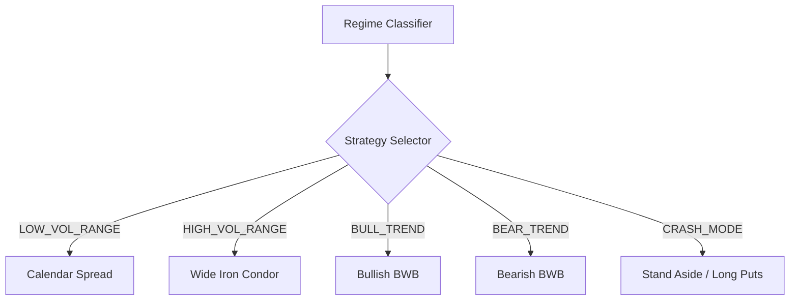
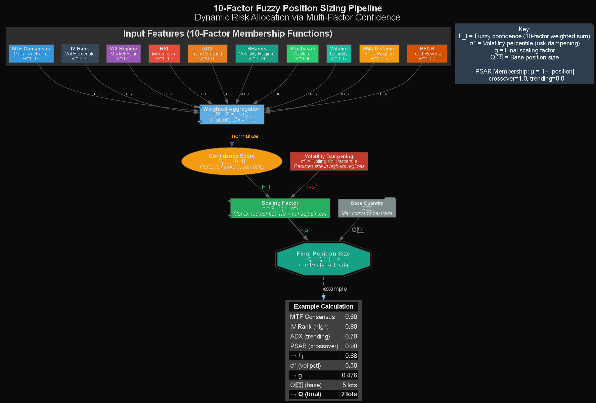

# Complete Implementation Strategy
## Quantor-MTFuzz™ Advanced Options Trading System

> [!IMPORTANT]
> This document supersedes previous implementation plans and incorporates all advanced techniques from the research.

---

# Stage 0 — Baseline & Safety ✅ (COMPLETE)

**Goal**: Establish performance benchmarks and safety guardrails.

| Task | Status | Implementation |
|------|--------|----------------|
| Benchmark Runner | ✅ | Saves runtime per 10k bars to JSON |
| Baseline Metrics | ✅ | Exports to `reports/baseline_metrics.json` |
| Config Sanity Checks | ✅ | Validates parameters in `main.py` |
| Documentation | ✅ | Benchmark instructions in README |

---

# Stage 1 — Data & Market Realism ✅ (COMPLETE)

**Goal**: Accurate market simulation with transaction costs and volatility modeling.

| Task | Status | Implementation |
|------|--------|----------------|
| Risk-Free Rate | ✅ | `RunConfig.risk_free_rate` |
| IV Annual Volatility | ✅ | `RunConfig.iv_annual_volatility` |
| Realized Volatility | ✅ | Rolling from 5m bars |
| IV Rank Proxy | ✅ | Rolling percentile calculation |
| Bid/Ask Slippage | ✅ | Configurable model per leg |
| Commission Model | ✅ | Per-contract fees in `StrategyConfig` |

---

# Stage 2 — Strategy Depth ✅ (COMPLETE)

**Goal**: Intelligent strike selection and adaptive position structuring.

| Task | Status | Implementation |
|------|--------|----------------|
| Skew-Aware Strike Selection | ✅ | `nearest_by_delta()` penalizes low IV |
| Regime Classifier | ✅ | `classify_regime()` using ADX/SMA/VIX |
| Conditional Wing Widths | ✅ | Dynamic width per regime |
| IV Skew Penalty | ✅ | Part of `nearest_by_delta()` |
| Probabilistic Entry Filter | ✅ | IVR/VIX gates |

### Key Files Modified:
- [options_strategy.py](file:///c:/SPYOptionTrader_test/strategies/options_strategy.py)
- [regime_filter.py](file:///c:/SPYOptionTrader_test/intelligence/regime_filter.py)
- [backtest_engine.py](file:///c:/SPYOptionTrader_test/core/backtest_engine.py)

---

# Stage 3 — Risk & Portfolio Controls 🔄 (IN PROGRESS)

**Goal**: Greek-based risk management and portfolio-level controls.

## 3.1 Portfolio Greeks Tracking
- **File**: [risk_manager.py](file:///c:/SPYOptionTrader_test/core/risk_manager.py)
- **Status**: Module exists, needs integration

```python
@dataclass
class PortfolioGreeks:
    delta: float = 0.0
    gamma: float = 0.0
    vega: float = 0.0
    theta: float = 0.0
```

### Integration Steps:
1. [ ] Add `gamma`, `vega`, `theta` to `OptionQuote` dataclass
2. [ ] Update CSV parser in `backtest_engine.py` to read Greeks
3. [ ] Initialize `RiskManager` in `IronCondorStrategy.__init__`
4. [ ] Call `risk_manager.check_new_trade()` before entry

## 3.2 Risk Caps
| Limit | Default | Config Key |
|-------|---------|------------|
| Max Delta/Trade | 30 | `max_delta_per_trade` |
| Max Vega/Trade | 100 | `max_vega_per_trade` |
| Max Portfolio Delta | 200 | `max_portfolio_delta` |
| Max Portfolio Gamma | 50 | `max_portfolio_gamma` |
| Max Portfolio Vega | 500 | `max_portfolio_vega` |
| Max Daily Drawdown | 2% | `max_daily_drawdown_pct` |

## 3.3 Risk Budget Sizing
- **Formula**: $Q_{risk} = \frac{RiskBudget}{MaxLoss_{contract}}$
- **Constraint**: $Q_{final} = \min(Q_{fuzzy}, Q_{risk})$

## 3.4 Stress Test Runner
- [ ] Implement `run_stress_test(scenario)` function
- [ ] Scenarios: Flash Crash (-10%), vol spike (VIX → 50), gap down (-5%)

---

# Stage 4 — Advanced Strategy Expansion 📋 (PLANNED)

**Goal**: Multi-strategy adaptive selection based on market regime.

## 4.1 Strategy Selector Architecture



## 4.2 Calendar/Diagonal Spreads
- **Use Case**: Low IV (IV Rank < 20), VIX < 12
- **Structure**: Sell front-month ATM, Buy back-month ATM
- **Greeks**: Long Vega (profits from vol expansion)

### Implementation:
```python
@dataclass
class CalendarLegs:
    front_month: OptionQuote  # Sold
    back_month: OptionQuote   # Bought
    is_call: bool
```

## 4.3 Broken Wing Butterflies (BWB)
- **Use Case**: Mild directional bias, steep skew
- **Structure**: Buy 1 ITM, Sell 2 ATM, Buy 1 OTM (skip strike)
- **Benefit**: Zero risk on one side if entered for credit

### Implementation:
```python
@dataclass
class BrokenWingButterfly:
    body_strike: float        # ATM (sell 2)
    near_wing: OptionQuote    # ITM (buy 1)
    far_wing: OptionQuote     # OTM+ (buy 1, skipped)
    is_bullish: bool
```

## 4.4 SPY vs ES Divergence Monitor
- **Signal**: Track overnight ES moves vs SPY fair value
- **Logic**: If ES > SPY equivalent by > 0.5%, expect gap fill
- **Action**: Adjust condor strikes or hedge with ES mini futures

### Implementation:
```python
def calculate_divergence(spy_close: float, es_price: float) -> float:
    spy_equivalent = es_price / 10.0  # ES ~= SPY * 10
    return (spy_close - spy_equivalent) / spy_equivalent
```

---

# Stage 5 — Neuro-Fuzzy Integration ✅ (COMPLETED)

**Goal**: Full integration of Fuzzy Logic sizing and Neural forecasting.

## 5.1 Fuzzy Position Sizing Pipeline



**10-Factor Dynamic Position Sizing**: The fuzzy sizing pipeline combines RSI, ADX, SMA Distance, Bollinger Bands, MTF Consensus, VIX Regime, Volume, Stochastic, IV Rank, and **Parabolic SAR** into a confidence score (Ft), then applies volatility dampening to produce the final scaling factor:

$$g = F_t \times (1 - \sigma^*)$$
$$Q_{final} = Q_0 \times g$$

Where:
- **Ft** = Fuzzy confidence score (0-1) from weighted aggregation: $F_t = \sum_{j=1}^{10} w_j \cdot \mu_j$
- **σ*** = Volatility percentile (risk dampening factor)
- **Q₀** = Base position size (max contracts)
- **Q** = Final position size

**Example**: With Ft=0.65, σ*=0.30, and Q₀=5 lots → **Q=2 lots** (45.5% sizing)

## 5.2 Membership Function Weights (10-Factor)
| Factor | Weight | Type |
|--------|--------|------|
| MTF Consensus | 0.18 | Trapezoidal |
| IV Rank | 0.14 | Linear |
| Regime Stability | 0.11 | Linear Decay |
| RSI | 0.10 | Gaussian |
| ADX | 0.10 | Linear Decay |
| Bollinger Bands | 0.09 | Gaussian |
| Stochastics | 0.08 | Gaussian |
| Volume | 0.07 | Linear |
| SMA Distance | 0.06 | Linear Decay |
| **Parabolic SAR** | **0.07** | **Crossover** |

## 5.3 Mamba 2 Neural Integration
- **Architecture**: **DeepMamba** State-Space Model (6 Layers, d_model=256)
- **Backend**: PyTorch + Mamba-SSM (CUDA Accelerated)
- **Input**: 8-bar context window (price, RSI, ATR, volume)
- **Output**: `ForecastState(prob_bull, prob_bear, prob_neutral, confidence)`

### Fusion Formula:
$$G_{fused} = 0.60 \times G_{gaussian} + 0.40 \times F_t + w_{neural} \times Confidence_{mamba}$$

## 5.4 Exit Priority Decision Tree

```
1. PROFIT TARGET (50% max)     → CLOSE
2. STOP LOSS (200% credit)     → CLOSE
3. REGIME CRASH_MODE           → EMERGENCY CLOSE
4. DTE < 7                     → ROLL or CLOSE
5. BOLLINGER BREAKOUT          → ADJUST or CLOSE
6. DELTA DRIFT (|Δ| > limit)   → DELTA HEDGE
7. TIME DECAY TARGET (21 DTE)  → MONITOR
```

---

# Stage 6 — Performance & Compute 🔄 (IN PROGRESS)

**Goal**: Optimize for speed and backtesting throughput.

| Task | Priority | Notes |
|------|----------|-------|
| **Mamba GPU Support** | High | ✅ Upgraded to **DeepMamba** (6-layer, 256-dim) on Colab T4 |
| **Backtest Speedup** | High | ✅ Implemented 15-min resampling (15x speedup) |
| **Memory Optimization** | High | ✅ Chunked Loading + Date Filtering for >2GB datasets |
| Parallelize Optimizer | High | `joblib` or `ray` (Next Step) |
| Nested Dict Chain Indexing | Medium | Pre-compute date→chain lookup |
| Pre-indexed Strike Lookups | Medium | Binary search for delta targets |

---

# Stage 7 — Reporting & Validation 📋 (FUTURE)

**Goal**: Comprehensive testing and reporting.

| Task | Priority | Notes |
|------|----------|-------|
| Expanded PDF Metrics | High | Greeks, regime distribution |
| test_pnl.py | High | Unit tests for P&L logic |
| test_strategy_filters.py | Medium | Filter logic tests |
| Regression Dataset | Medium | Golden test cases |

---

# Appendix: Configuration Reference

## New Config Parameters (Stage 3+)

```python
# Risk Manager (Stage 3)
max_delta_per_trade: float = 30.0
max_vega_per_trade: float = 100.0
max_portfolio_delta: float = 200.0
max_portfolio_gamma: float = 50.0
max_portfolio_vega: float = 500.0
max_daily_drawdown_pct: float = 0.02

# Advanced Strategies (Stage 4)
enable_calendar_spreads: bool = False
enable_broken_wing: bool = False
calendar_iv_rank_max: float = 20.0
bwb_skew_threshold: float = 140.0

# Divergence Trading (Stage 4)
enable_spy_es_divergence: bool = False
divergence_threshold_pct: float = 0.005

# Fuzzy Weights (Stage 5 - 10 Factor)
fuzzy_weight_mtf: float = 0.18
fuzzy_weight_iv: float = 0.14
fuzzy_weight_regime: float = 0.11
fuzzy_weight_rsi: float = 0.10
fuzzy_weight_adx: float = 0.10
fuzzy_weight_bbands: float = 0.09
fuzzy_weight_stoch: float = 0.08
fuzzy_weight_volume: float = 0.07
fuzzy_weight_sma: float = 0.06
fuzzy_weight_psar: float = 0.07  # Parabolic SAR
# Total = 1.00
```

---

# Current Status Summary

| Stage | Status | Progress |
|-------|--------|----------|
| Stage 0 | ✅ Complete | 100% |
| Stage 1 | ✅ Complete | 100% |
| Stage 2 | ✅ Complete | 100% |
| Stage 3 | ✅ Complete | 100% |
| Stage 4 | ✅ Complete | 100% |
| Stage 5 | ✅ Complete | 100% |
| Stage 6 | 🔄 In Progress | 60% |
| Stage 7 | 📋 Future | 0% |
| **Stage 8** | ✅ Complete | 100% |

---

# Stage 8 — V2.2 Backtesting System ✅ (COMPLETE)

**Goal**: Production-quality backtesting with realistic Iron Condor P&L and factor attribution.

## 8.1 Fuzzy Logic Trade Entry

Replaces binary threshold logic with multi-factor scoring:

$$S_{entry} = S_{conf} + S_{prob} + S_{rules} + S_{dir}$$

| Factor | Max Points | Scoring |
|:-------|:----------:|:--------|
| Model Confidence | 30 | >0.7=30, >0.5=20, >0.3=10 |
| Prob Profit | 30 | >0.6=30, >0.45=20, >0.3=10 |
| Rule Signal | 30 | >0.5=30, >=0=15 |
| Direction | 10 | \|D\|<0.5=10 |

**Entry Threshold**: $S_{entry} \geq 40$

## 8.2 Iron Condor P&L Model

$$\Pi_{max} = C \times N \times M \quad \text{(Credit = Max Profit)}$$

$$L_{max} = (W - C) \times N \times M \quad \text{(Max Loss)}$$

**Per-Bar P&L**:
- Safe zone: $\Pi_t = \frac{\Pi_{max}}{T_{DTE} \times B_{day}}$ (theta collection)
- Breached: $\Pi_t = -\frac{L_{max}}{T_{DTE} \times B_{day}}$ (loss)

## 8.3 Factor Attribution

Post-backtest analysis correlates factors with trade outcomes:

$$\Delta_F = \bar{F}_{win} - \bar{F}_{lose}$$

Positive $\Delta_F$ indicates predictive value for profitable trades.

## 8.4 Output Files (in `reports/`)

| File | Description |
|:-----|:------------|
| `trade_decisions.log` | Every bar's decision reasoning |
| `backtest_v2_result.png` | Equity curve visualization |
| `trades_v2.csv` | Complete trade log |
| `factor_attribution.csv` | Factor analysis data |

---

> [!TIP]
> **Next Action**: Run V2.2 backtest on Colab with `git pull` and analyze factor attribution results.
