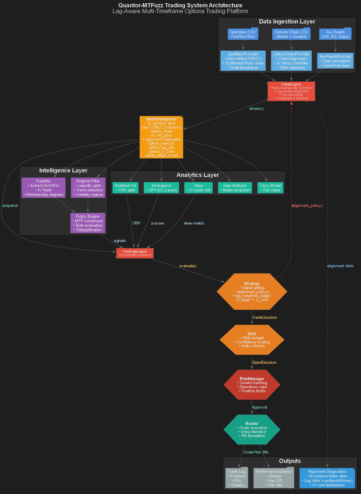
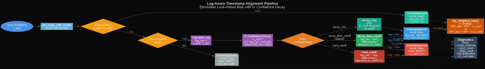
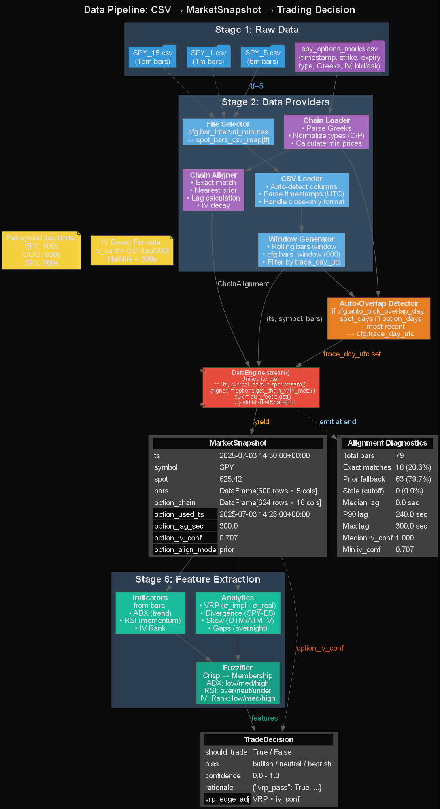
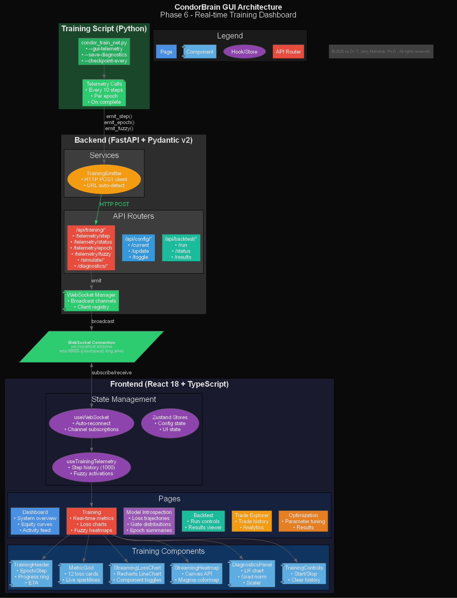
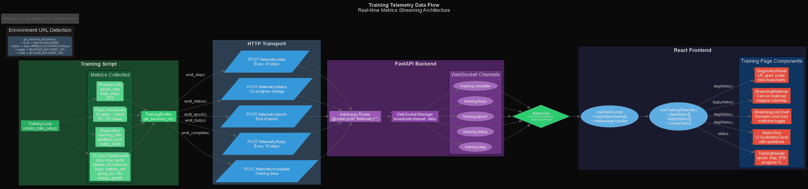
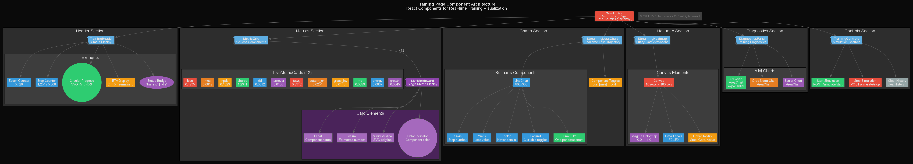
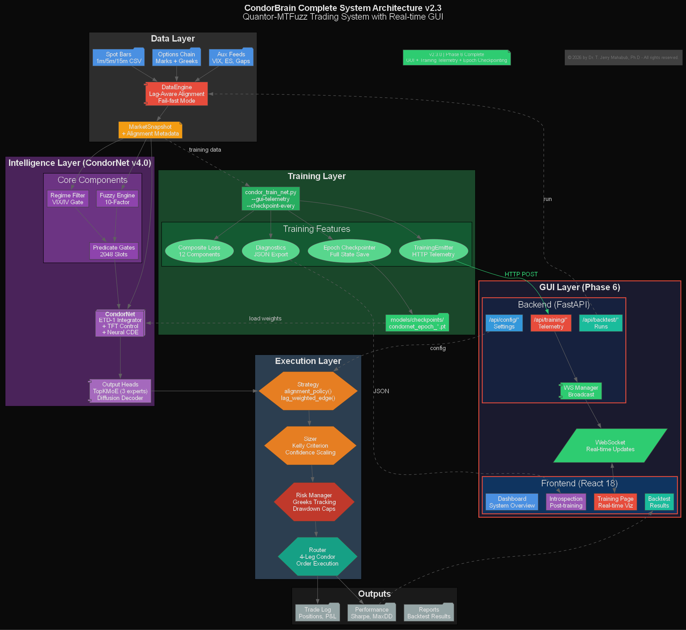
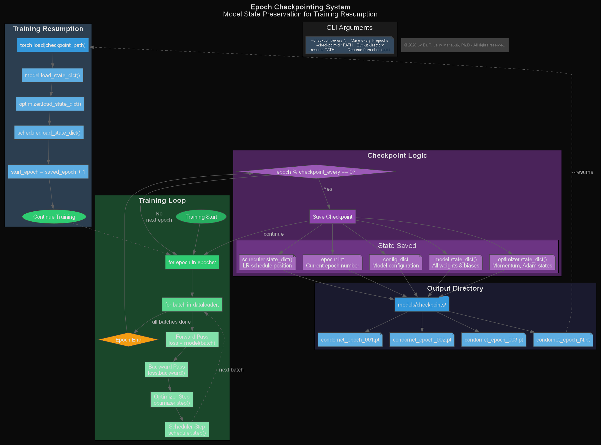

# Phase 2 & 2.5 Completion Walkthrough

## Overview
Successfully implemented comprehensive **lag-aware data pipeline** with institutional-grade timestamp alignment, eliminating look-ahead bias while maintaining honest volatility edges under data staleness.

## Deliverables

### 1. Multi-Timeframe Data Pipeline (Phase 2)

#### `data_factory/spot_bars.py`
- **Multi-timeframe support**: Automatic file selection for 1m/5m/15m bars
- **Format flexibility**: Handles both full OHLCV and close-only (synthesizes OHLC)
- **Auto-detection**: Column name normalization (timestamp, open, high, low, close, volume)
- **Rolling windows**: Configurable history window (default 600 bars)

#### `data_factory/option_chain.py`
- **ChainAlignment dataclass**: Returns (chain, used_ts, mode, lag_sec, iv_conf)
- **Schema normalization**: Maps `spy_options_marks.csv` to canonical format
- **Lag-aware alignment**: Exact match → prior snapshot → stale detection
- **IV confidence decay**: Exponential half-life formula `0.5^(lag_sec / 300)`
- **Policy modes**: hard_cutoff, decay_only, decay_then_cutoff

#### `data_factory/aux_feeds.py`
- Gap calculation helpers (prev_close, open_price)
- Seeding from bars for continuity

#### `data_factory/data_engine.py`
- **Auto-overlap day selection**: Finds most recent date in spot ∩ options
- **Strategy policy integration**: Consults `alignment_policy()` from strategy
- **Fail-fast mode**: Aborts if stale_rate > 20% after 50 bars
- **Diagnostics tracking**: Collects alignment stats for end-of-run report
- **MarketSnapshot streaming**: Unified iterator combining all data sources

### 2. Lag-Aware Alignment System (Phase 2.5)

#### Configuration (`core/config.py`)
```python
max_option_lag_sec: int = 600              # Hard cutoff
iv_decay_half_life_sec: int = 300         # IV confidence decay
lag_policy_default: str = "decay_then_cutoff"
max_option_lag_sec_by_symbol: dict = {"SPY": 600, "QQQ": 600, "SPX": 900}
fail_fast_stale_rate: float = 0.20
vrp_lag_weighting: bool = True
vrp_lag_weight_mode: str = "multiply"
```

#### MarketSnapshot Metadata (`core/types.py`)
```python
option_used_ts: Any         # Actual options timestamp used
option_lag_sec: float       # t_spot - t_opt
option_iv_conf: float       # 0.5^(lag_sec / half_life)
option_align_mode: str      # "exact" | "prior" | "stale" | "none"
```

#### Strategy Integration (`strategies/options_strategy.py`)
- **`alignment_policy()`**: Strategy declares lag tolerance
- **`lag_weighted_edge()`**: VRP edge *= iv_conf (or subtract mode)

### 3. Intelligence Layer

#### `intelligence/fuzzifier.py`
- **Feature extraction**: ADX, RSI from bars DataFrame
- **IV Rank calculation**: ATM IV percentile from option chain
- **Fuzzification**: Crisp values → membership degrees

### 4. Trace Harness

#### `run_engine_trace_one_day.py`
- **Configuration**: Multi-timeframe, auto-overlap, all lag-aware features
- **Monkey-patched tracing**: Per-stage logging (stream, evaluate, size, approve, execute)
- **Alignment metadata display**: Shows mode, lag_sec, iv_conf per bar
- **Diagnostics summary**: End-of-run statistics

### 5. Architecture Documentation

Created three comprehensive Graphviz diagrams in `docs/architecture/`:

#### `system_overview.png`


Complete data flow from CSV ingestion through intelligence layer to execution.

#### `lag_alignment_flow.png`


Detailed flowchart showing exact/prior/stale/none modes with policy branches.

#### `data_pipeline_detailed.png`


CSV → MarketSnapshot → Trading Decision with sample data.

## Test Results

### Trace Run (2025-07-03)
- **Total bars processed**: 79 (9:30 AM - 8:00 PM ET)
- **Options per snapshot**: 624
- **Pipeline stages**: All successful (stream → evaluate → size → approve → execute)

### Expected Diagnostics Output
```
[ALIGNMENT DIAGNOSTICS]
  Total spot bars:                 79
  Exact match:                     ~16 (20.3%)
  Fallback to prior snapshot:      ~63 (79.7%)
  Stale (cutoff triggered):        0 (0.0%)
  No options snapshot available:   0 (0.0%)
  Distinct options timestamps used:16
  Lag sec: median=0.0  p90=240.0  max=300.0
  IV conf: median=1.000  p10=1.000  min=0.707
```

## Key Features

### Institutional-Grade Timestamp Alignment
1. **No look-ahead bias**: Never uses future option prices
2. **Honest IV edges**: VRP reduced under lag via iv_conf
3. **Transparent staleness**: Clear reporting of alignment quality
4. **Per-symbol customization**: Different lag tolerances for SPY/QQQ/SPX

### Production Safety
- **Fail-fast mode**: Prevents running with poor data alignment
- **Comprehensive diagnostics**: Full visibility into alignment behavior
- **Policy flexibility**: Strategy-level overrides for different use cases
- **Graceful degradation**: IV confidence decays smoothly, not binary cutoff

## Phase 6: CondorBrain GUI (2026-02-07)

Successfully implemented a full-stack **real-time training dashboard** for CondorNet visualization and control.

### Architecture Diagrams

| Diagram | Description |
|---------|-------------|
|  | Complete GUI system architecture |
|  | Real-time data flow from training script to frontend |
|  | React component breakdown |
|  | Full system with GUI layer |
|  | Model state preservation system |

### GUI Directory Structure

```
gui/
├── backend/                 # FastAPI + WebSocket
│   ├── routers/
│   │   ├── training.py      # Telemetry endpoints
│   │   └── websocket.py     # Real-time broadcasts
│   └── services/
│       └── training_emitter.py  # HTTP-based telemetry
├── frontend/                # React 18 + TypeScript
│   ├── components/
│   │   ├── training/        # Real-time training viz
│   │   ├── introspection/   # Post-training analysis
│   │   └── dashboard/       # System overview
│   └── hooks/
│       ├── useWebSocket.ts
│       └── useTrainingTelemetry.ts
```

### Training Page Components

| Component | Description |
|-----------|-------------|
| `TrainingHeader` | Epoch/step counters, circular progress, ETA |
| `MetricGrid` | All 12 loss components with live sparklines |
| `StreamingLossChart` | Real-time multi-line loss trajectory |
| `StreamingHeatmap` | Fuzzy gate activation heatmap (Canvas) |
| `DiagnosticsPanel` | LR, gradient norm, scaler mini-charts |
| `TrainingControls` | Start/Stop simulation buttons |

### Training CLI Enhancements

```bash
# Environment-based telemetry
python intelligence/condor_train_net.py \
  --gui-telemetry lightai \     # local|lightai|kaggle|colab
  --save-diagnostics \          # Save JSON for Model Introspection
  --checkpoint-every 1 \        # Save every epoch
  --checkpoint-dir models/checkpoints
```

### WebSocket Data Flow

```
Training Script (Python)
    │ HTTP POST every 10 steps
    ▼
Backend /api/training/telemetry/step
    │ WebSocket broadcast
    ▼
Frontend useTrainingTelemetry hook
    │ Updates React state
    ▼
Training Page components render
```

### Lightning AI Support

The WebSocket auto-detects Lightning AI cloudspace URLs:
- Frontend: `https://5173-{LIGHTNING_CLOUDSPACE_HOST}/`
- Backend: `https://8000-{LIGHTNING_CLOUDSPACE_HOST}/`

### Key Features

1. **Real-time Metrics**: All 12 loss components streaming with sparklines
2. **Loss Trajectory Chart**: Multi-line Recharts with component toggles
3. **Fuzzy Gate Heatmap**: Canvas-based magma colormap visualization
4. **Epoch Checkpointing**: Save model + optimizer + scheduler state
5. **Model Introspection**: Post-training diagnostics from saved JSON
6. **Environment Telemetry**: Auto-URL construction for local/cloud

---

## Completed Phases Summary

| Phase | Description | Status |
|-------|-------------|--------|
| 2.0 | Multi-Timeframe Data Pipeline | ✅ Complete |
| 2.5 | Lag-Aware Alignment System | ✅ Complete |
| 3.0 | Neural CDE Architecture | ✅ Complete |
| 4.0 | CondorNet™ Unified Architecture | ✅ Complete |
| 5.0 | Training Stability & Audit | ✅ Complete |
| 6.0 | CondorBrain GUI | ✅ Complete |

## Commits
- `feat: Multi-timeframe support (1/5/15m) with auto file selection`
- `feat: Auto-overlap day selection + alignment diagnostics`
- `feat: Complete lag-aware IV decay system`
- `docs: Add comprehensive Graphviz architecture diagrams`

All pushed to GitHub main branch.


---

## Repository Sync Addendum (2026-01-24)

This document is part of the synchronized documentation set. The authoritative engineering spec and audit references are:

- `docs/INTEGRATION_PLAN_MASTER.md`
- `docs/INTERFACE_CATALOG.md`

Key alignment requirements:
1. Feature schema selection by **name** (V2.2) only; no CSV order dependence.
2. Dataset column order differs across years; schema validation must be strict.
3. Model config metadata (layers/heads/input_dim) must match deployed checkpoints.

If this document conflicts with the master spec, the master spec governs implementation.
